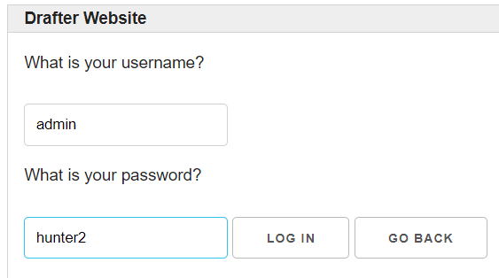
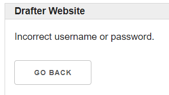

# Login Example {#login}

Here is an application that allows you to login and logout. There is a very silly password checker that checks if the username and password are correct based on literal values. This is just an example, and you should not actually make a password checker like this! But it demonstrates how you can have a simple login system for your application.

{width="500px"}

{width="500px"}

{width="500px"}

{width="500px"}

```python
from drafter import *
from dataclasses import dataclass

@dataclass
class State:
    username: str
    logged_in: bool

@route
def index(state: State) -> Page:
    if state.logged_in:
        body = [
            Header("Welcome to my site!"),
            "You are logged in as " + state.username + ".",
            Button("Log out", do_logout)
        ]
    else:
        body = [
            Header("Welcome to my site!"),
            "You are not logged in.",
            Button("Log in", ask_login)
        ]
    return Page(state, body)

@route
def ask_login(state: State) -> Page:
    return Page(state, [
        "What is your username?",
        TextBox("username", state.username),
        "What is your password?",
        TextBox("password"),
        Button("Log in", finish_login),
        Button("Go back", index)
    ])

def check_password(username: str, password: str) -> bool:
    # Protip: Real password checking looks nothing like this :)
    if username == "admin" and password == "password":
        return True
    elif username == "ada" and password == "lovelace":
        return True
    return False

@route
def finish_login(state: State, username: str, password: str) -> Page:
    state.username = username
    if check_password(username, password):
        state.logged_in = True
        return index(state)
    else:
        return reject_login(state)

@route
def reject_login(state: State) -> Page:
    return Page(state, [
        "Incorrect username or password.",
        Button("Go back", index)
    ])

@route
def do_logout(state: State) -> Page:
    state.logged_in = False
    return index(state)

start_server(State("", False))

```
