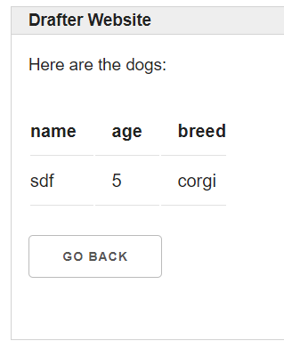

# Nested Data {#nested}

This application has a list of dataclass instances as its model, demonstrating much more complex nested data.

This is a more advanced application! It might not make sense until you\'ve read later chapters in the Bakery textbook.

{width="500px"}

{width="500px"}

{width="500px"}

```python
from dataclasses import dataclass
from drafter import *
from bakery import assert_equal

@dataclass
class Dog:
    name: str
    age: int
    breed: str

@route
def index(state: list[Dog]) -> Page:
    return Page(state, [
        "There are " + str(len(state)) + " dogs",
        "What do you want to do?",
        Button("Add a dog", add_dog_page),
        "View the dogs.",
        Button("View the dogs", view_dogs_page)
    ])

@route
def add_dog_page(state: list[Dog]) -> Page:
    return Page(state, [
        "What is the dog's name?",
        TextBox("name"),
        "What is the dog's age?",
        TextBox("age"),
        "What is the dog's breed?",
        SelectBox("breed", ["corgi", "schnauzer", "mutt"]),
        Button("Add this dog", finish_adding_dog_page),
        Button("Go back", index)
    ])

@route
def finish_adding_dog_page(state: list[Dog], name: str, age: str, breed: str) -> Page:
    state.append(Dog(name, int(age), breed))
    return index(state)

@route
def view_dogs_page(state: list[Dog]) -> Page:
    return Page(state, [
        "Here are the dogs:",
        Table(state),
        Button("Go back", index)
    ])

start_server([], reloader=True)

```
