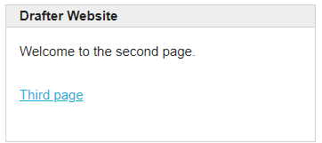
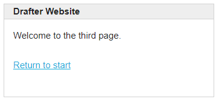

# Ring Example

This application demonstrates three pages linked together.






```python
from drafter import route, start_server, Page, Link
from bakery import assert_equal


@route()
def index():
    return Page(None, [
        "Hello, World!",
        Link("Second page", "second")
    ])


@route
def second():
    return Page(None, [
        "Welcome to the second page.",
        Link("Third page", third)
    ])


@route
def third():
    return Page(None, [
        "Welcome to the third page.",
        Link("Return to start", index)
    ])


assert_equal(index(), Page(None, ["Hello, World!", Link("Second page", "second")]))
assert_equal(second(), Page(None, ["Welcome to the second page.", Link("Third page", third)]))
assert_equal(third(), Page(None, ["Welcome to the third page.", Link("Return to start", index)]))

start_server()
```
