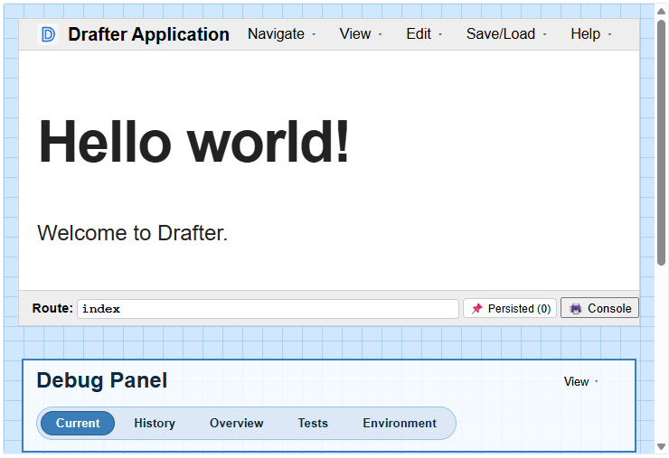

# Build your first app

## What you'll build

A counter website: it shows a number, and three buttons change it. 
By the end you will have used every core piece of Drafter.

## What you need

- Drafter [installed and verified](install.md).
- About ten minutes.

Every step below shows the complete program so far. The demos on this page
are live: you can click them, edit them, and run them right here. To follow
along on your own computer, copy a step's code into a Python file and run
it; your site opens in the browser.

## Step 0: Start the server

Behold! the shortest possible Drafter program:

```python drafter height=220
from drafter import *

start_server()
```

`#!python start_server()` launches your site. We have not written any pages yet, so
Drafter shows a default page to prove the server is up.

When you run this page in Thonny, you will also see the debug panel. 
You can see what this looks like in the screenshot below.
The Debug Panel has a lot of features, but we can ignore them for now.



## Step 1: Add your main page

A page in Drafter is created by a function. Marking a function with `#!python @route` tells
Drafter that the function should be reachable in the browser and returns a page - any function that returns a page is known as a route.
The function named `#!python index` is your site's main route,
and every Drafter site should have one.

```python drafter height=220
from drafter import *


@route
def index() -> Page:
    return Page([
        "Hello from Drafter!"
    ])


start_server()
```

Three things to notice:

- `#!python @route` marks the function as a route function of your site.
- `#!python index` is the name of the main route function.
- The function returns a `#!python Page` holding the content to show.

## Step 2: Put more content on the page

The content of a `#!python Page` is a list. Each item in the list appears on the
page, in order. For now the items are strings; soon they will include
buttons.

```python drafter height=220
from drafter import *


@route
def index() -> Page:
    return Page([
        "This is a simple Drafter page.\n",
        "Each string in the list becomes text on the page.\n",
        "Items appear in the order you list them."
    ])


start_server()
```

**Predict first**: if you swap the first two strings in the list, what will
the page look like? Try it in the demo above.

??? question
    The order of the strings in the list determines the order they appear on the page.

## Step 3: Give the app something to remember

Our goal is to make a counter, which needs to remember a number. In Drafter, everything your app
remembers lives in one dataclass, which we always call `#!python State`.

```python drafter height=220
from drafter import *
from dataclasses import dataclass


@dataclass
class State:
    count: int


@route
def index(state: State) -> Page:
    return Page(state, [
        "Current count: " + str(state.count)
    ])


start_server(State(0))
```

Follow the number `#!python 0` through the program:

- `#!python State(0)` creates the starting data, with `#!python count` set to `#!python 0`.
- `#!python start_server(State(0))` hands that starting data to your site.
- `#!python index` receives it as `#!python state`, and shows `#!python state.count` on the page.

Notice the two changes from Step 2: `#!python index` now takes `#!python state` as its first
parameter, and `#!python Page(state, [...])` now carries the state along with the
content.

## Step 4: Change the starting value

**Predict first**: what will the page show if you change the last line to
`start_server(State(10))`?

```python drafter height=220
from drafter import *
from dataclasses import dataclass


@dataclass
class State:
    count: int


@route
def index(state: State) -> Page:
    return Page(state, [
        "Current count: " + str(state.count)
    ])


start_server(State(10))
```

The counter starts at `#!python 10`. The starting value you pass to
`#!python start_server(...)` is where your app begins.

## Step 5: Add buttons that change the number

Let's add a button so we can interact with the page.
A `#!python Button` needs two things: the text on the button, and the route function
to run when it is clicked.

```python
Button("+1", "increment")
```

This button shows `#!python +1` and runs the `#!python increment` route when clicked. 
Notice that we didn't call the function directly (which would involve parentheses), but instead gave its name as a string?
Drafter will call the function for us when the button is clicked.
This delayed execution is essential to how Drafter works: the page is built, sent to the browser, and then the user clicks a button. The function doesn't run until the user clicks!

Let's see how this looks in a complete program:

```python drafter height=280
from drafter import *
from dataclasses import dataclass


@dataclass
class State:
    count: int


@route
def index(state: State) -> Page:
    return Page(state, [
        "Current count: " + str(state.count) + "\n",
        Button("+1", "increment"),
        Button("-1", "decrement"),
        Button("Reset", "reset_count")
    ])


@route
def increment(state: State) -> Page:
    state.count = state.count + 1
    return index(state)


@route
def decrement(state: State) -> Page:
    state.count = state.count - 1
    return index(state)


@route
def reset_count(state: State) -> Page:
    state.count = 0
    return index(state)


start_server(State(0))
```

Click the buttons in the demo and watch the number change. Here is the
loop your app is running:

1. The user clicks a button.
2. The button's function runs. It changes `#!python state.count`.
3. That function returns `#!python index(state)`, so the main page is shown again
   with the updated number.

## Step 6: Prove it works with tests

You can check your pages without clicking anything, because pages are
ordinary functions you can call. Drafter's `#!python assert_` functions compare
what a page produced with what you expected, and report SUCCESS or
FAILURE.

```python drafter height=280
from drafter import *
from dataclasses import dataclass


@dataclass
class State:
    count: int


@route
def index(state: State) -> Page:
    return Page(state, [
        "Current count: " + str(state.count) + "\n",
        Button("+1", "increment"),
        Button("Reset", "reset_count")
    ])


@route
def increment(state: State) -> Page:
    state.count = state.count + 1
    return index(state)


@route
def reset_count(state: State) -> Page:
    state.count = 0
    return index(state)


assert_state(increment(State(0)), State(1))
assert_state(reset_count(State(7)), State(0))
assert_has(index(State(3)), "Current count: 3")

start_server(State(0))
```

Read the first test aloud: calling `#!python increment` on a state of 0 should
produce a state of 1. The tests run every time the program starts, before
the site opens. You will see where their results appear in the
[next step](debug-panel.md).
For now, if you run this in Thonny, you will see the following appear in the console:

```text
SUCCESS at line 31 (assert_state)
SUCCESS at line 32 (assert_state)
SUCCESS at line 33 (assert_has)
```

## Common problems

- **The page shows an error about `#!python Page` content**: the content must be a
  list, even for one item. Write `#!python Page(["Hello"])`, not `#!python Page("Hello")`.
- **The page shows a "points to non-existent page" error**: the name in
  `Button("+1", "increment")` must exactly match a route function you
  defined with `@route`. Check the spelling.
- **You changed `#!python State` and things broke**: the fields in `#!python State(...)`
  must match the dataclass definition. `#!python State(0)` works because `#!python State`
  has exactly one field.
- **Nothing happens after `#!python start_server(...)`**: that is normal.
  `#!python start_server` hands your program over to the site;
  [lines after it do not run](../help/errors/nothing-after-start-server.md). 
  Go check the site in your browser: the URL will be something like <http://localhost:8000>.

## Name it

You have already used the ideas; here are their names, which the rest of
the docs use:

- The functions marked with `#!python @route` are **routes**. Each route returns a page
  of your site. See [How Drafter works](how-drafter-works.md).
- The dataclass your app remembers is its **state**. Buttons changed it;
  the page displayed it.
- The `assert_` lines are **tests**. They call routes like ordinary
  functions and check the results.

## Make it yours

Before moving on, change the app so it is yours. In rough order of
difficulty:

1. Change the starting value to `#!python State(5)`.
2. Add a `#!python +5` button (you will need a fourth route).
3. Stop the counter from going below zero (change `#!python decrement`).
4. Count something you care about, and change the page text to match.

## Next steps

<div class="grid cards" markdown>

- **Next: Make one visible change**

    ---

    Practice the edit, save, reload loop, break the app on purpose, and
    read your first friendly error.

    [Make one visible change](make-a-change.md)

</div>
