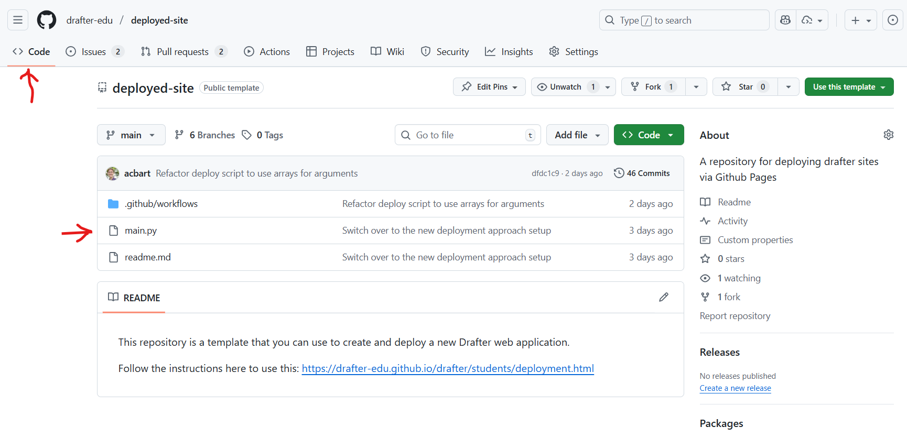
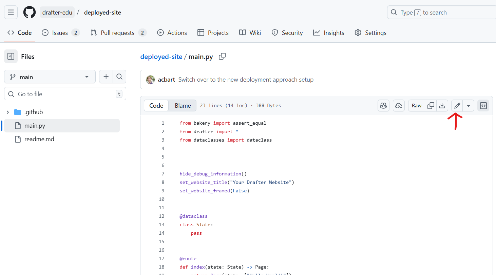
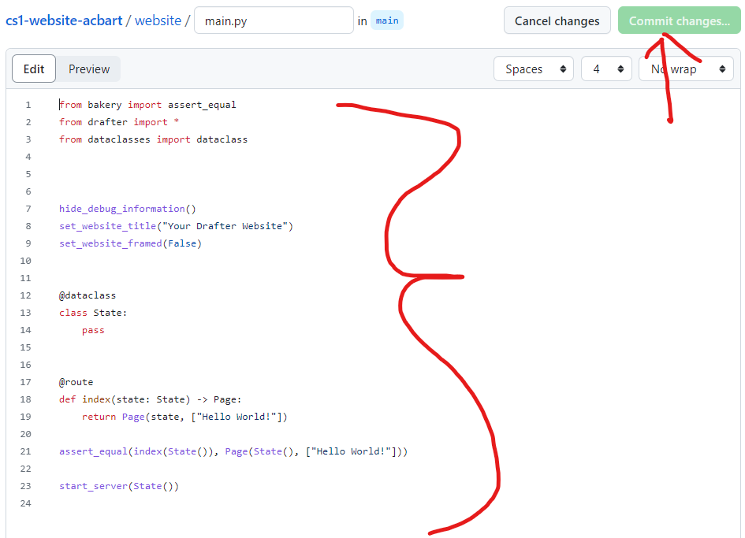
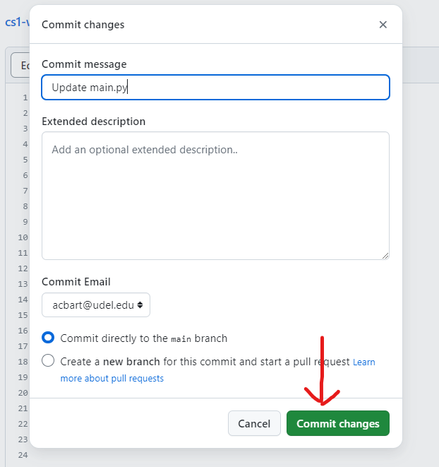
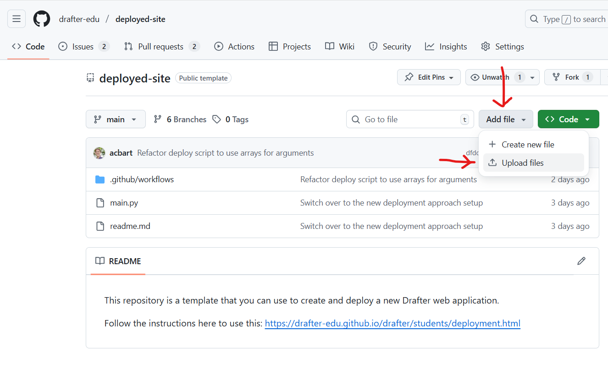
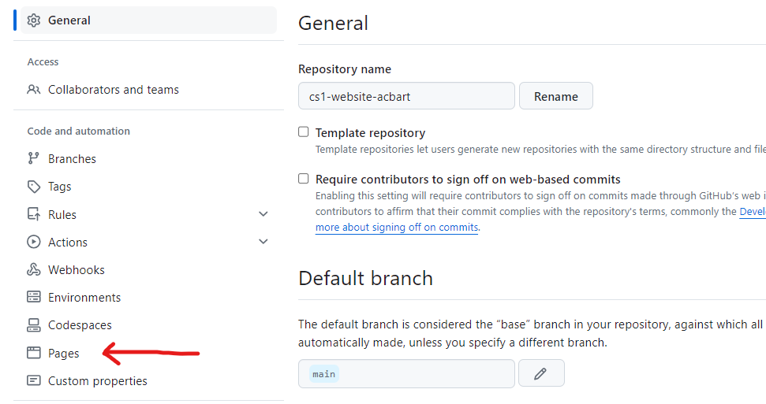
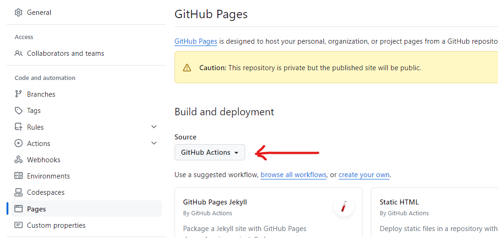
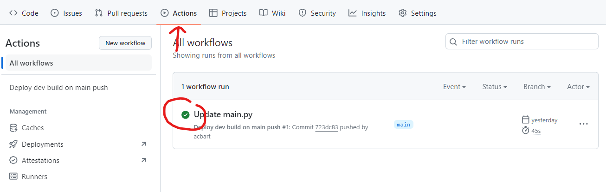
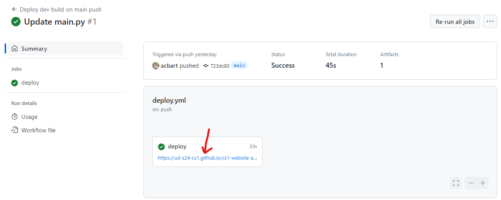

# Publish on GitHub Pages

## Goal

Your prepared app, live on the web with a shareable URL, hosted for free
by GitHub Pages.

## Before you start

You need three things:

- A **GitHub account**: [create one here](https://github.com/signup) if
  you do not have one.
- Your [prepared](prepare.md) program.
- A repository that includes Drafter's deploy workflow. Courses usually
  provide a template link that creates this repository for you, with a
  `main.py` file and the workflow already in place; use your course's
  link if you have one.

!!! note "Choosing a GitHub username"
    Your username will be part of your site's URL and visible to anyone
    you share it with, including future employers looking at your
    portfolio. Pick something professional you will not mind saying in
    an interview: a variation of your name beats `xX_gamer_Xx`. Adding
    your school email to the account (GitHub allows several emails) also
    unlocks student benefits and makes it easier for instructors to
    recognize you.

The flow is: put your code in the repository, turn on Pages, run the
workflow, get your URL.

## Step 1: Put your code in the repository

1. Open your repository on GitHub and go to the **Code** tab.
2. Click `main.py`, then the pencil icon to edit it.
3. Replace its contents with your program (paste from your editor).
4. Click **Commit changes**, write a short message describing the change,
   and confirm.

??? example "Show what this looks like"
    The Code tab lists the repository's files, with `main.py` among
    them:

    

    Opening `main.py` shows its contents; the pencil icon starts
    editing:

    

    After pasting your code, Commit changes is at the top right:

    

    A box asks for a commit message describing your change:

    

Your whole program lives in `main.py`. If your app uses other files,
images, data files, add them too: **Add file**, then **Upload files**,
drag them in next to `main.py`, and commit. Every file your program
opens must be here, or it will
[404 on the live site](../../help/errors/missing-asset-on-deploy.md).

??? example "Show the upload screen"
    

## Step 2: Turn on GitHub Pages

1. Go to the repository's **Settings** tab.
2. Open the **Pages** section in the left sidebar.
3. Under **Source**, choose **GitHub Actions**.

This is a one-time switch. Skipping it is the single most common cause
of a failed first deployment.

??? example "Show what this looks like"
    The Settings tab is in the repository's top bar:

    

    In Pages, set the Source dropdown to GitHub Actions:

    

## Step 3: Run the deploy workflow

1. Go to the **Actions** tab.
2. Select the deploy workflow in the left sidebar (named something like
   "Deploy main branch as website").
3. Click **Run workflow**, then confirm with the green button.

The deployment takes a minute or two. Watch its progress in the Actions
tab: a green checkmark means success. A red X means something needs
fixing; [Fix a failed deployment](troubleshooting.md) walks you from
the red X to the exact error and back here.

??? example "Show the Actions tab"
    

## Step 4: Find your URL and check your site

1. Click into the successful (green) run; the deployed URL is shown in
   its summary.
2. Open the URL and click through your **whole app**: every page, every
   button, any picture or file it uses.
3. Open it again **on a different device**, like your phone.

??? example "Show a successful run with its URL"
    

The URL looks like `https://your-username.github.io/your-repository/`.
That is your site's address; share that one, not the `github.com`
repository link and not any `localhost` address.

**Does everything work, on both devices?** Then congratulations: you
built a piece of software and shipped it to the web, where anyone on
Earth can use it. That is not a small thing. Save the URL somewhere you
will find it again; this link belongs in a portfolio.

One more thing before you celebrate too hard: if this project is for a
course, **you are probably not done yet**. Courses usually have their
own submission steps beyond deploying, so open your course's
instructions now and finish those while everything is fresh.

## Updating a deployed site

The site redeploys when you tell it to, not on every commit. To ship a
change: edit or upload the files (Step 1), then run the workflow again
(Step 3). The newest run in the Actions list is the one that counts.

## Common problems

- **The first run fails immediately**: Pages is probably not enabled;
  redo Step 2, then run the workflow again.
- **The site is up but a picture or file is missing**: it was never
  uploaded to the repository. Upload it next to `main.py` and redeploy.
- **The site shows an old version**: you committed changes but did not
  run the workflow again, or the browser cached the old page. Redeploy,
  then hard-refresh.
- Anything else: [Fix a failed deployment](troubleshooting.md) walks the
  error logs.

## Understand it

[Deploy and submit](index.md): what compiling to a static site means.

## See another example

The [project gallery](../gallery/index.md) apps are all published this
way.

## Look it up

The deployment dashboard and logs are described in
[Fix a failed deployment](troubleshooting.md).

## Fix a problem

[Fix a failed deployment](troubleshooting.md) and
[GitHub Actions build failed](../../help/errors/deploy-build-failed.md).

## Next steps

- **Next: Get feedback on your design**

    ---

    Your app is live, which means people can actually use it. Learn how
    to watch them do it and make the app better.

    [Get feedback](../get-feedback.md)

