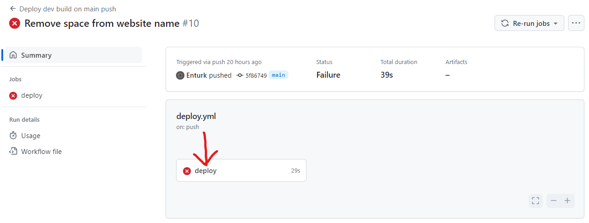
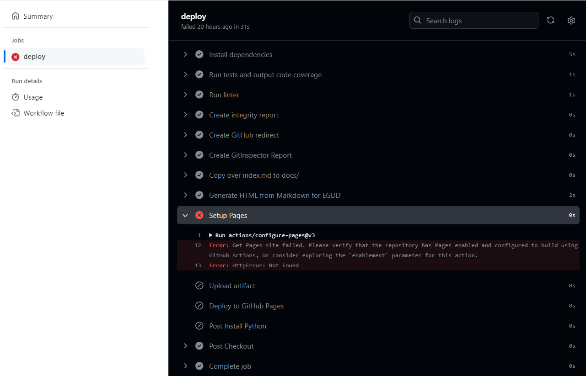
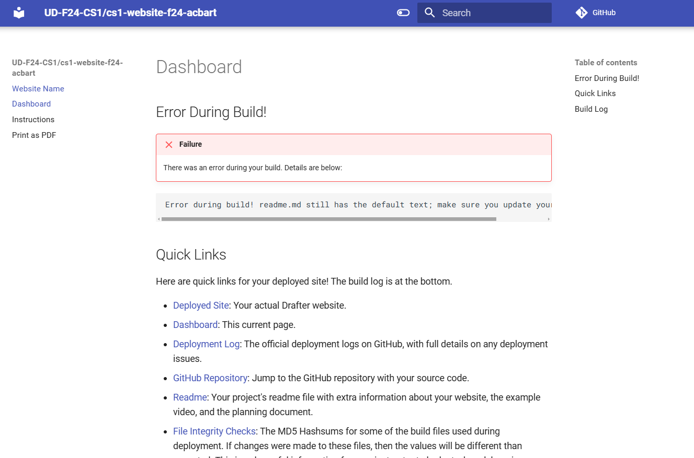

# Fix a failed deployment

!!! note "Only here because something broke?"
    Good, you are in the right place. If your deployment actually
    **succeeded** (a green checkmark, and the site works), you do not
    need this page at all; head back to
    [finish checking your site](github-pages.md#step-4-find-your-url-and-check-your-site).

A red X in the Actions tab means the deployment failed. That is normal,
fixable, and always explained somewhere in a log. This page is the path
from red X to green checkmark.

## Read the error

1. In the **Actions** tab, click the failed (red X) run.
2. Click the red X inside it to open the job, then expand the failing
   step to see the log.
3. Read the last several lines. The actual error is almost always named
   there, often with a Python error message you already know how to
   read.

Old failed runs in the list do not matter. Only the most recent run
counts, so a history of red is fine once the top one is green.

??? example "Show what a failed run looks like"
    Clicking the red X opens the run, and the failing step within it:

    

    Expanding the failing step shows the log with the actual error; this
    one is a missing Pages configuration:

    

## The usual suspects

- **Pages not enabled.** The log complains about Pages or permissions,
  and the fix is Settings → Pages → Source → **GitHub Actions**, then
  run the workflow again. This is the most common first-deploy failure.
- **A syntax error in your code.** The log shows a Python traceback.
  Fix the code locally (where you can run it), then commit the fixed
  `main.py` and redeploy. If it does not run on your computer, it will
  not deploy.
- **A missing file.** Your program opens a file or shows an image that
  was never uploaded to the repository. Upload it next to `main.py` and
  redeploy. Details:
  [works locally, 404s deployed](../../help/errors/missing-asset-on-deploy.md).
- **A wrong filename.** The deploy expects your program in `main.py`,
  exactly. Renaming it breaks the build; put your code in `main.py`.
- **An import the browser cannot satisfy.** Not every third-party
  library works in the deployed runtime; see
  [a library import fails in the browser](../../help/errors/package-import-error.md).

## The deployment dashboard

Whether the deploy succeeded or failed, your site has a diagnostic page:
take your deployed URL and add `dashboard/` to the end, like
`https://your-username.github.io/your-repository/dashboard/`.

Errors and warnings appear at the top, followed by quick links (the
site, the logs, the repository, your tests) and the full build log of
every step Drafter took. When a deploy half-works, the dashboard is the
fastest way to see which half.

??? example "Show the dashboard"
    

## Retry

Deployments do not rerun themselves. After every fix: **Actions** tab,
select the deploy workflow, **Run workflow**. Then watch the new run at
the top of the list.

## Still stuck?

- Confirm the app runs locally with no errors and passing tests.
- Compare your repository against [the publish steps](github-pages.md)
  one by one; most stubborn failures are a skipped step.
- Bring the exact error line from the log to
  [Getting help](../../help/index.md); "deployment failed" is
  undebuggable, but the real error text is.
