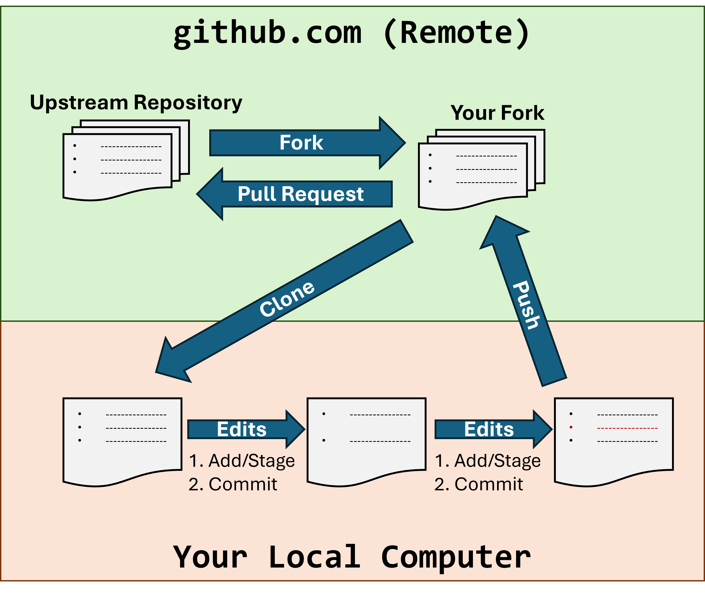
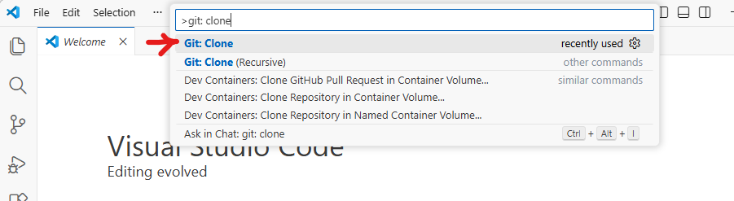
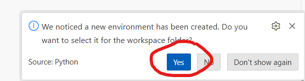
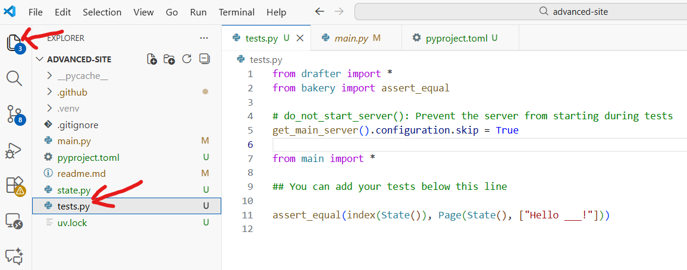
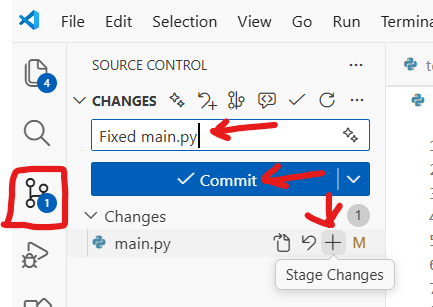
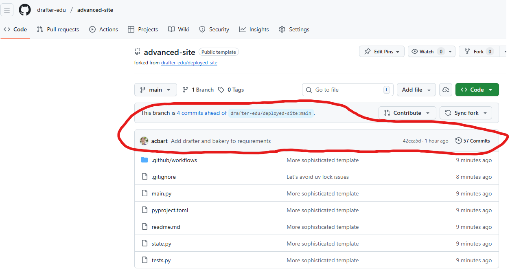
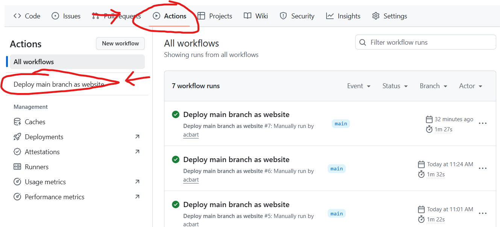

.. _local_setup:

======================================
Local Python Development Setup Guide
======================================

This guide will walk you through setting up your computer for Python development using Visual Studio Code (VS Code).
By the end of this guide, you will have a fully functional development environment with Git, Python, VS Code, and all the tools you need to write, test, and share your code.

.. contents:: Table of Contents
   :local:
   :depth: 2

Step 1: Install Git
===================

**What is Git?**
Git is a version control system that tracks changes to your code over time. It lets you save snapshots of your work, go back to previous versions if something breaks, and collaborate with others. Almost all professional developers use Git.

**Why do you need Git?**
You'll use Git to download code from GitHub (a website that hosts code), save your own code changes, and submit your work.

.. tabs::

   .. group-tab:: Windows

      1. Go to the Git download page: https://git-scm.com/downloads/win

      2. Click the **"Click here to download"** link to download the installer (it will download a file like ``Git-2.xx.x-64-bit.exe``)

         .. image:: images/vscode_download_git.png
            :alt: Download Git Installer

      3. Run the downloaded installer by double-clicking on it

      4. **Important:** During installation, you will see many screens with options. For most screens, you can just click **Next** to accept the default settings.

      5. Click **Install** and wait for the installation to complete

      6. Click **Finish** when done

   .. group-tab:: Mac

      There are two ways to install Git on Mac. We recommend installing Homebrew since that will also help you install other tools in the future. If you have trouble with Homebrew, you can use the Xcode Command Line Tools method.

      **Option A: Install via Homebrew**

      You probably do not have Homebrew installed yet, so first we need to install Homebrew using the Terminal:

      1. Open Terminal
      2. Copy and paste the line of code below into Terminal and press Enter to install Homebrew

      .. code-block::

        /bin/bash -c "$(curl -fsSL https://raw.githubusercontent.com/Homebrew/install/HEAD/install.sh)"

      3. When it asks for password, type yours in. It’ll output a lot of text, and then beneath a large list of tags, you see a purple arrow with "Next Steps".

      4. Close the terminal and start a new Terminal window to ensure Homebrew is added to your PATH.

      5. To confirm that Homebrew is installed correctly, type the following command in Terminal and press Enter:

      .. code-block::

        brew help

      6. Some help text should appear. If it does, Homebrew is installed correctly! Next you need to install Git using Homebrew. Type the following command in Terminal and press Enter:

      .. code-block::

        brew install git

      **Option B: Install via Xcode Command Line Tools**

      1. Open the **Terminal** application:

         - Press ``Command + Space`` to open Spotlight Search
         - Type ``Terminal`` and press Enter

      2. In Terminal, type the following command and press Enter:

         .. code-block:: bash

            xcode-select --install

      3. A popup will appear asking you to install the command line developer tools. Click **Install**

      4. Wait for the installation to complete (this may take several minutes)


Step 2: Install Visual Studio Code (VS Code)
============================================

**What is VS Code?**
Visual Studio Code (VS Code) is a code editor - it's like a word processor, but designed specifically for writing code. It has features like syntax highlighting (coloring your code to make it easier to read), error detection, and extensions that add extra functionality.

**Why do you need VS Code?**
While you could write Python code in any text editor (even Notepad), VS Code makes coding much easier with features like auto-completion, error highlighting, and integrated terminal access.

.. tabs::

   .. group-tab:: Windows

      1. Go to the VS Code download page: https://code.visualstudio.com/Download

      2. Click the **Windows** download button (it will download a file like ``VSCodeUserSetup-x64-1.xx.x.exe``)

         .. image:: images/vscode_download_windows.png
            :alt: VS Code Windows Download Button

      3. Run the downloaded installer

      4. Accept the license agreement and click **Next**

      5. On the "Select Additional Tasks" screen, we recommend checking these boxes if they are available:
         
         - **"Add 'Open with Code' action to Windows Explorer file context menu"** - lets you right-click on files to open them in VS Code
         - **"Add 'Open with Code' action to Windows Explorer directory context menu"** - lets you right-click on folders to open them in VS Code
         - **"Add to PATH"** - lets you open VS Code from the command line


      6. Click **Next**, then **Install**

      7. When installation completes, you can check **"Launch Visual Studio Code"** and click **Finish**

   .. group-tab:: Mac

      1. Go to the VS Code download page: https://code.visualstudio.com/Download

      2. Click the **Mac** download button (it will download a ``.zip`` file)

         .. image:: images/vscode_download_mac.png
            :alt: VS Code Mac Download Button

      3. Open the downloaded ``.zip`` file (usually in your Downloads folder). This will extract the VS Code application

      4. Drag the **Visual Studio Code.app** to your **Applications** folder

      5. Open VS Code by going to your Applications folder and double-clicking on **Visual Studio Code**

      6. If you see a warning that says "Visual Studio Code is an app downloaded from the Internet. Are you sure you want to open it?", click **Open**


The VS Code Welcome Screen will look something like this:

.. image:: images/vscode_welcome_screen.png
   :alt: VS Code Welcome Screen

Step 3: Install UV
==================

**What is Python?**
Python is a programming language - it's the language you'll use to write your code. Python is also the name of the program on your computer that runs Python code.

**Why do you need Python?**
You need Python installed on your computer to run Python programs. While VS Code is where you'll write your code, Python is what actually executes it. If you used Thonny previously, Python was included with it, but for VS Code, you need to install Python separately.

**What is UV?**
UV is a fast Python package manager.
It helps you install Pythonn and libraries (pre-written code that you can use in your projects) and manage project dependencies (libraries that your project needs to work).

**Why do you need UV?**
First, we can use UV to easily install Python itself.
Second, UV helps manage dependencies for your projects.
When you download a Python project, it often requires additional libraries to run. UV makes it easy to install all these libraries with a single command.


.. tabs::

   .. group-tab:: Windows

      1. To install UV, we'll need to use the Terminal integrated into VS Code. Click the ``View`` menu at the top and then click ``Terminal``:

      .. image:: images/vscode_open_terminal.png
        :alt: VS Code Open Terminal

      This will likely open the PowerShell Terminal by default on Windows. You can verify this by looking at the dropdown in the top-right of the Terminal window. If the dropdown shows "PowerShell", you're good to go. If it shows something else (like Command Prompt), click the dropdown arrow and select **PowerShell** from the list.

      .. image:: images/vscode_choose_powershell.png
         :alt: VS Code Open PowerShell

      2. Copy and paste this command into PowerShell, then press Enter:

         .. code-block:: powershell

            powershell -ExecutionPolicy ByPass -c "irm https://astral.sh/uv/install.ps1 | iex"

      3. Wait for the installation to complete

      4. In order for the changes to take effect, close VS Code and then start it again.

      5. In the new PowerShell window, type ``uv --version`` and press Enter

      6. You should see a version number like ``uv 0.x.x`` - this means UV is installed correctly!

         .. image:: images/vscode_uv_version.png
            :alt: VS Code Terminal showing uv --version output on Windows

   .. group-tab:: Mac

      1. To install UV, we'll need to use the Terminal integrated into VS Code. Click the ``View`` menu at the top and then click ``Terminal``:

      .. image:: images/vscode_open_terminal.png
        :alt: VS Code Open Terminal

      2. Copy and paste this command, then press Enter:

         .. code-block:: bash

            curl -LsSf https://astral.sh/uv/install.sh | sh

      3. Wait for the installation to complete

      4. In order for the changes to take effect, create a new Terminal tab by clicking the plus (+) icon in the terminal window.

      **Verify the installation:**

      1. In the new Terminal window, type ``uv --version`` and press Enter

      2. You should see a version number like ``uv 0.x.x`` - this means UV is installed correctly!

         .. image:: images/vscode_uv_version.png
            :alt: VS Code Terminal showing uv --version output on Windows

Step 4: Install Python
======================

1. In the VS Code terminal, type the following command and press Enter:

   .. code-block:: bash

      uv python install

2. Wait for the installation to complete. UV will download and install Python for you.

3. After installation, type the following command and press Enter to verify Python is installed:

   .. code-block:: bash

      uv run python

   This should open the Python interactive shell, showing the Python version number and system information.
   At the time of this writing, it is Python 3.14.0a6, but you might see a different version if a newer one is available.
   You can actually run Python code here, but we just wanted to verify the installation.

4. You can exit the Python shell by typing ``exit()`` and pressing Enter.

Step 5: Install the Python Extension for VS Code
================================================

**What is the Python Extension?**
The Python extension adds Python-specific features to VS Code, like intelligent code completion, debugging, and the ability to run Python code directly from the editor.

**Why do you need it?**
Without this extension, VS Code is just a text editor. With the extension, VS Code understands Python and can help you write better code faster.

1. Open VS Code

2. Click on the **Extensions** icon in the left sidebar (it looks like four squares, with one square separated from the others)

   .. image:: images/vscode_extension_button.png
      :alt: VS Code Extensions Icon

3. In the search box at the top, type ``ms-python.python``

4. Find the extension called **"Python"** by Microsoft (it should be the first result with millions of downloads)

   .. image:: images/vscode_python_extension.png
      :alt: VS Code Python Extension

5. Click the extension, and then click the **Install** button

6. Wait for the installation to complete. You should see the button change to "Installed" or show a gear icon

**Verify the installation:**

1. Press ``Ctrl + Shift + P`` (Windows) or ``Command + Shift + P`` (Mac) to open the Command Palette
2. Type ``Python: Select Interpreter`` and press Enter
3. You should see your installed Python version in the list. Select it.

   .. image:: images/vscode_python_version.png
      :alt: VS Code Select Python Interpreter


Step 6: Apply for GitHub Student Developer Pack
===============================================

**What is the GitHub Student Developer Pack?**
The GitHub Student Developer Pack is a collection of free tools and services for students. It includes free access to GitHub Copilot, cloud credits, domain names, and many other developer tools.

**Why should you apply?**
As a student, you get access to professional tools that would normally cost money. GitHub Copilot alone (which you will set up in Step 7) normally costs $10/month, but it's free for students!

**How to Apply:**

1. Go to https://education.github.com/pack

2. Click the **"Sign up for Student Developer Pack"** button

   .. image:: images/vscode_student_developer.png
      :alt: GitHub Student Developer Pack Sign Up Button

3. Log in to your GitHub account if you haven't already

4. Select **"Student"** when asked about your academic status

5. Choose your school from the list (or type to search for it)

6. **Verify your student status** - you'll need to provide proof that you're a student. Options include:

   - Using your school email address (often ends in ``.edu``)
   - Uploading a photo of your student ID
   - Uploading other academic documents

7. Submit your application

8. Verification can sometimes take a few minutes to a few days, depending on the verification method. If you used your school email, it may be instant. If it takes longer, then continue onto step 8 and return here later.

9. Once approved, you'll receive an email confirming your access to the Student Developer Pack

.. note::
   If you're having trouble getting verified, try:

   - Using your official school email address
   - Making sure your student ID photo is clear and shows your name, the current date/semester, and your school's name
   - Waiting a few days and trying again if the automatic verification fails


Step 7: Setup GitHub Copilot
============================

**What is GitHub Copilot?**
GitHub Copilot is an AI-powered coding assistant that suggests code as you type. It can help you write code faster by suggesting completions, entire functions, and even helping you understand unfamiliar code.

**Why should you use it?**
As a student, you have free access to GitHub Copilot. It's like having a helpful coding partner that can suggest solutions and help you learn new programming patterns. However, you must think very critically about the suggestions it makes, as they may not always be correct or optimal. Also, as you learn to code, it's important to understand the code you write rather than relying too heavily on AI suggestions. Over-relying on AI tools can hinder your learning process.

**Prerequisites:**

- You need a GitHub account.
- You need to have the GitHub Student Developer Pack (from Step 6) to access Copilot for free.

**Installing the GitHub Copilot Extension:**

1. Open VS Code

2. Click on the **Extensions** icon in the left sidebar

3. In the search box, type ``GitHub.copilot``

4. Find and install **"GitHub Copilot"** by GitHub (look for the official one with millions of downloads)

5. Click **Install**

6. After installation, you'll see a prompt to sign in to GitHub. Click **Sign in to GitHub**. If you don't see a prompt, then look in the bottom corner of the screen for a button that says "Signed out", and click that.

7. Your browser will open. Log in to your GitHub account if prompted, and authorize VS Code to access your account

8. Return to VS Code. You should see that Copilot is now active.

**How to use Copilot:**

Once Copilot is activated, it will automatically suggest code as you type. When you see a gray suggestion appear:

- Press ``Tab`` to accept the suggestion
- Press ``Esc`` to dismiss it
- Keep typing to ignore it and write your own code

You can also:

- Press ``Ctrl + Enter`` (Windows) or ``Command + Enter`` (Mac) to see multiple suggestions
- Type a comment describing what you want, and Copilot will suggest code to match

.. note::
   Copilot suggestions are helpful, but always review them before accepting. The suggestions are not always correct, and understanding what the code does is important for your learning. You may want to disable Copilot temporarily if you find yourself relying on it too much.


Step 8: Fork and Clone a Repository
===================================

**What is GitHub?**

GitHub is a website that hosts code repositories. It uses ``Git`` for version control and makes it easy to share code with others, collaborate on projects, and track changes over time. Since you installed Git in Step 1, you can now use Git to interact with repositories on GitHub.

**What is Forking?**
Forking creates your own copy of someone else's project on GitHub. This copy belongs to you, so you can make changes without affecting the original project (referred to as the "Upstream", as opposed to your "Fork"). Think of it like making a copy of a Google Doc to your own Google Drive so you can edit it.

**What is Cloning?**
Cloning downloads a copy of a GitHub repository to your computer so you can work on it locally. Think of it like downloading a Google Doc to your computer to edit it offline.

**Why do you need to do this?**
When working on assignments or collaborative projects, you'll often start with code that someone else has written. Forking gives you your own copy to work on, and cloning puts that copy on your computer. Later on, we'll learn how to push your changes back to GitHub.



**Step 8a: Fork the Repository**

1. Use the URL provided by your instructor to create a new repository on Github. **Make sure you use the instructor provided URL for your classroom!**

.. note::

    You must use the link from the assignment on Canvas. Do **NOT** use the URL from your final project. This is a different repository!

2. Wait for GitHub to create your fork. You'll be taken to your forked repository (notice the URL now shows your username).

**Step 8b: Clone the Repository to Your Computer**

1. On your forked repository page, click the green **Code** button

.. image:: images/vscode_clone_button.png
   :alt: GitHub Code Button

2. Make sure **HTTPS** is selected (not SSH), and click the copy icon to copy the URL

3. Return to VS Code.

4. Press ``Ctrl + Shift + P`` (Windows) or ``Command + Shift + P`` (Mac) to open the Command Palette

5. Type ``Git: Clone`` and select it




6. Type ``Ctrl+V`` (Windows) or ``Cmd+V`` (Mac) to paste the previously copied link and press enter.

7. If you are asked to authenticate on GitHub, do so.

8. A folder select window will prompt you to "Choose a folder to clone into." We recommend that you create a "Projects" folder in your home directory to keep all your coding projects organized, and then also create folders for each course inside of that. Select that folder (or any folder you prefer) and click **Select Folder**.

.. danger::

    Do not store your projects in system folders like "Program Files" or "Applications". These folders may have restricted permissions that can interfere with Git operations. Also avoid using folders like "Downloads" since they can get cluttered and make it hard to find your projects later.

8. Click **Select as Repository Destination**

9. VS Code will download the repository. When it asks "Would you like to open the cloned repository?", click **Open**

10. If prompted to trust the authors of the files in the repository, click **Yes, I trust the authors**

You now have the project on your computer and open in VS Code!


Step 9: Install Dependencies and Run Tests
===========================================

**What are Dependencies?**
Dependencies are external libraries that a project needs to work. Most Python projects use libraries written by other developers to avoid reinventing the wheel. Drafter is an example of such a library.

**What are Tests?**
Tests are code that checks if other code works correctly. Running tests tells you if the project is set up correctly and if your changes break anything.

There are many different libraries for testing in Python. Drafter works particularly well with the Bakery testing framework, which is meant for novices.

**Why do you need to do this?**
Before making changes to a project, you should install its dependencies so the code can run, and run the tests to make sure everything is working. This gives you a baseline to compare against after you make changes.

**Step 9a: Open the Terminal in VS Code**

1. In VS Code, open the integrated terminal if it is not already open:
   
   - Press ``Ctrl + ``` (backtick, the key below Escape) on Windows
   - Or press ``Command + ``` on Mac
   - Or go to **View** → **Terminal** in the menu

**Step 9b: Install Dependencies**

1. In the terminal, type the following command and press Enter:

   .. code-block:: bash

      uv sync

   This command reads the project's dependency file and installs all required libraries.

2. Wait for UV to download and install all dependencies. You'll see progress messages in the terminal. You will probably see a lot of output as it installs packages, this is normal.

3. If you see a message in the bottom-right that says "We noticed a new environment has been created. Do you want to select it for the workspace folder?", click "Yes".



**Step 9c: Run the Tests**

1. In the terminal, type the following command and press Enter:

   .. code-block:: bash

      uv run tests.py

   This runs all the tests in the project.

2. Look at the output. You should see something like:

   .. code-block:: text

        FAILURE - [line 11] assert_equal(index(State()), Page(State(), ["Hello ___!"])), predicted answer was Page(state=State(), content=['Hello ___!']), computed answer was Page(state=State(), content=['Hello World!']).


3. If you see failing tests, don't worry! This is expected - your task is to fix them in the next step.


Step 10: Fix the Issue and Confirm It Works
===========================================

Now that you've set up the project and identified failing tests, it's time to fix the issue.

**Step 10a: Understand the Problem**

1. Look at the test output to see the details on the failing test.

2. The failing tests usually give you a clue about what's wrong. Look for:

   - The line number where the failure occurred
   - The expected value vs. the actual value

3. Open the ``tests.py`` file in VS Code to see the test code. You can find it in the file explorer on the left side.



Previously, we usually put our tests in the same file as our code, but now they are separated. This is a common practice in professional development. That way, we can run our tests (``tests.py``) independently of our main code (``main.py``). Notice we have a special line of code to prevent the server from starting when we run tests.

We'll break up a lot of our code into multiple files in the future, like separating out our data models into ``state.py``. For now, let's focus on fixing the test.

**Step 10b: Make Your Fix**

1. The failing test is in the ``tests.py`` file. However, the actual issue is in the main code file that gets imported by ``tests.py``. Notice the lines above the tests where we import the code to be tested: ``from main import *``. This means the code to fix is in ``main.py``.

2. Open the ``main.py`` file in VS Code. Notice that the test failure mentioned something about "Hello ___!" vs. "Hello World!". Look for the part of the code that generates this output, and fix the returned value to match the test.

3. Save your file (``Ctrl + S`` on Windows, ``Command + S`` on Mac)

**Step 10c: Run the Tests Again**

1. In the terminal, run the tests again:

   .. code-block:: bash

      uv run tests.py

2. Check if your fix worked:
   
   - If all tests pass, congratulations! Your fix worked!
   - If tests still fail, read the error messages, adjust your code, and try again


Step 11: Add, Commit, and Push Your Changes
===========================================

**What is Add, Commit, and Push?**

- **Add (Stage)**: Tells Git which file changes you want to include in your next save point
- **Commit**: Creates a save point (snapshot) of your changes with a message describing what you did
- **Push**: Uploads your commits to GitHub so they're saved online and visible to others

**Why do you need to do this?**
This is how you save your work to GitHub. Without pushing, your changes only exist on your computer. Pushing ensures your work is backed up and can be submitted.

It may be helpful to think of this process like filling out a shopping cart:

- **Add** is like putting items into your cart
- **Commit** is like checking out and paying for the items in your cart
- **Push** is like shipping the items to your home

Often times, you'll make multiple changes before committing. You can add files multiple times before committing, and you can commit multiple times before pushing.

Recall the diagram we showed you before? This will cover most of the remaining parts of it!


**Step 11a: Stage Your Changes**

1. In VS Code, click on the **Source Control** icon in the left sidebar (it looks like a branching line, and may show a number indicating changed files)



2. You'll see a list of files you've changed under "Changes"

3. Hover over the "Changes" header and click the **+** icon to stage all changes
   
   Or, hover over individual files and click the **+** icon next to each file to stage specific files

**Step 11b: Commit Your Changes**

1. In the text box at the top of the Source Control panel, type a clear, descriptive message about what you changed. For example:
   
   - "Fix calculation error in get_total function"
   - "Add missing return statement"

2. Click the **Commit** button (checkmark icon) or press ``Ctrl + Enter`` (Windows) / ``Command + Enter`` (Mac)

**Step 11c: Push Your Changes to GitHub**

1. After committing, click the **Sync Changes** button that appears (or click the three dots menu and select **Push**)

2. If this is your first time pushing, VS Code may ask you to log in to GitHub. Follow the prompts to authorize VS Code.

.. danger:: "Need to Configure Git"

    If you encounter an error like “need to configure git” before you can push, then you can run the following commands in the terminal, substituting your email address and name.

    .. code-block::

        git config --global user.email "YOUREMAIL@udel.edu"
        git config --global user.name "YOUR NAME"

    Make sure you replace ``YOUREMAIL`` with your UD Email, and ``YOUR NAME`` with your name (e.g., ``Austin Bart``).

3. Wait for the push to complete. You'll see a notification when it's done.

**Verify your changes on GitHub:**

1. Go to your forked repository on GitHub (``https://github.com/ORGANIZATION/repository-name``)

2. You should see your recent commit message and the updated files




Step 12: Enable and Check GitHub Actions
========================================

**What is GitHub Actions?**
GitHub Actions is GitHub's automation system. It can automatically run tests, check code quality, and perform other tasks whenever you push code.

**What is GitHub Pages?**
GitHub Pages is a service that lets you host websites directly from your GitHub repository. It's often used for project documentation or personal websites.
We can use GitHub Pages to deploy our Drafter projects online.

**Why do you need to check it?**
Many projects use GitHub Actions to automatically run tests when you push changes. This gives you (and your instructor) confirmation that your code works correctly.
It's also used to deploy your project to GitHub Pages so others can access it online.

**Step 11a: Enable GitHub Pages**

You need to turn on GitHub Pages in order to host your site. Go to the ``Settings`` tab of your repository.

.. image:: ../students/images/deployment_github_settings.png
    :alt: Github Settings

On the left side of the page, scroll down and click on ``Pages``. Under the source dropdown, select ``GitHub Actions``.

.. image:: ../students/images/deployment_github_pages.png
    :alt: Github Pages

Your site is now configured for deployment.

**Step 11b: Run the Workflow**

Once you have uploaded your files and updated your code, you need to manually trigger the deployment of your website.

1. Go to the ``Actions`` tab of your repository



2. Click on the ``Deploy main branch as website`` workflow on the left side

3. Click the ``Run workflow`` button on the right side, then click the green ``Run workflow`` button in the dropdown

.. image:: ../students/images/deployment_github_workflow.png
    :alt: Run workflow button

Your site will now start deploying! You can monitor the progress in the Actions tab.

**If the deployment succeeds** (green checkmark), you'll see a link to your deployed website.

.. image:: ../students/images/deployment_github_actions.png
    :alt: Github Actions Success

**If you see a red X**, there was an error. Click on the red X to see the job summary, then click the next red X to see the deployment logs. The error message will help you understand what went wrong.

.. image:: ../students/images/deployment_github_details.png
    :alt: Details about errors during deployment

Step 13: Develop
================

Now that your development environment is set up, you can start building your own projects! Here are some advanced tips to help you get started:

Running Locally
---------------

Run your site locally with ``uv run main.py`` and open your browser to ``http://localhost:8080`` to see your changes in action. To stop the server, go back to the terminal and press ``Ctrl + C``.

Debug Locally
-------------

You can set breakpoints in VS Code by clicking in the gutter next to the line numbers. Then, run the debugger by pressing ``F5`` or going to the Run and Debug panel. This lets you step through your code and inspect variables.

.. image:: images/vscode_debug_menu.png
   :alt: VS Code Debug Menu

AI Help
-------

You can use the Chat menu to ask questions to an LLM Agent about your code. Click the ``View`` menu, then ``Chat`` to open the chat panel. Type your question and get instant help!

.. image:: images/vscode_chat_menu.png
   :alt: VS Code Chat Panel

Note that we have created a custom AI agent that is specialized in Drafter and Python development. This agent has access to the Drafter documentation and can help you with specific questions about using Drafter and developing web applications. You are free to modify this agent by editing the ``AGENTS.md`` file in your repository.

Congratulations!
================

You've successfully set up your local Python development environment! You now have:

- Git for version control
- Python to run your code
- VS Code as your code editor
- The Python extension for VS Code features
- UV for managing Python packages
- GitHub Copilot for AI-assisted coding
- The skills to fork, clone, and work with repositories
- Knowledge of how to run tests and push changes
- Access to the GitHub Student Developer Pack

