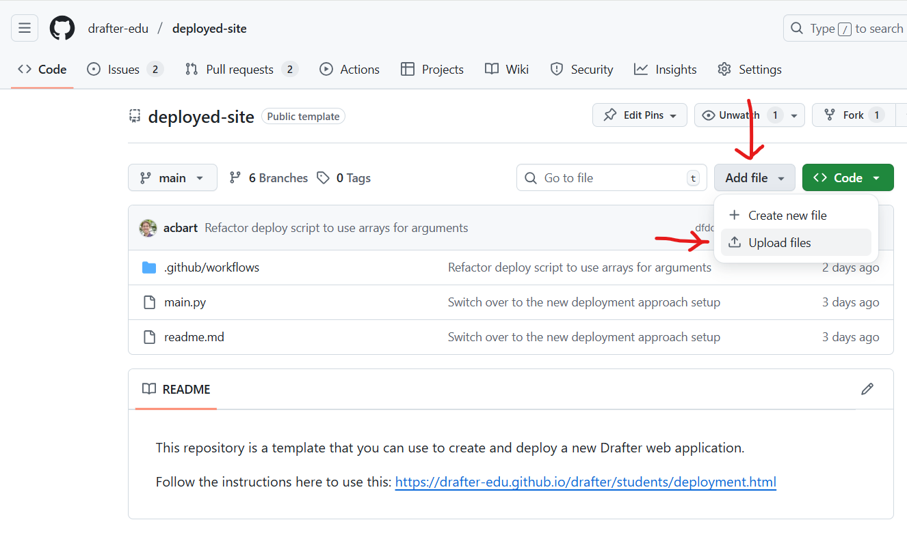

.. _deployment:

Deployment
==========

When you have finished developing your website, you can deploy it to the world on a server.
GitHub Pages is a free and easy way to host your website.
Although normally Github Pages is only useful for hosting frontend websites, Drafter can still work with it.

Follow these 9 steps in order to deploy your website:

Step 1: Create the Repository
------------------------------

Use the URL provided by your instructor to create a new repository on Github. **Make sure you use the instructor provided URL for your classroom!**

Once the repository is created, you will see that there are already a bunch of files present, and a settings bar.

.. image:: images/deployment_github_main.png
    :alt: Github Repository

Step 2: Enable GitHub Pages
----------------------------

You need to turn on GitHub Pages in order to host your site. Go to the ``Settings`` tab of your repository.

.. image:: images/deployment_github_settings.png
    :alt: Github Settings

On the left side of the page, scroll down and click on ``Pages``. Under the source dropdown, select ``GitHub Actions``.

.. image:: images/deployment_github_pages.png
    :alt: Github Pages

Your site is now configured for deployment.

Step 3: Edit Your Main.py File
-------------------------------

.. warning::
    If your instructor has requirements about commit messages, review those before doing this step. **Commit messages are very hard to change after the fact.**

Go to the ``Code`` tab and you will see a few files listed. The most important file is ``main.py``, which is where your website code goes. Click on ``main.py``.

.. image:: images/deployment_github_code2.png
    :alt: Github Code

When you click on the file, it will show you the contents. Click on the pencil icon to edit the file.

.. image:: images/deployment_github_edit2.png
    :alt: Github Edit Main

The editor area allows you to paste in your code. You must add the following lines of code to your project to set up your site's metadata.
Put these lines after the import statements, but before the ``start_server(...)`` line.
We suggest placing them right before your dataclasses and routes.

.. code-block:: python

    set_site_information(
        author="your_email@udel.edu",
        description="""A brief description of what your website does.
        Use a triple quoted string if you want to span multiple lines.""",
        sources=["List any help resources or sources you used"],
        planning=["your_planning_document.pdf"],
        links=["https://github.com/your-username/your-repo"]
    )
    hide_debug_information()
    set_website_title("Your Website Title")
    set_website_framed(False)

These lines of code:

1. **Set the site information** - This is required and provides metadata about your site including your email, description, sources, planning document filename, and relevant links.
2. **Hide debug information** - You may want to comment this line out while debugging.
3. **Set the title** - This sets the title shown in the browser tab.
4. **Make the website full screen** - This makes the website stretch to fill the whole screen instead of a small box.

There are many other ways to style your website, but these are a good starting point.

.. note::
    You can change the filename, but this might cause deployment issues. Do not change the filename unless your instructor says it is okay.

When you are done editing, click on the ``Commit changes`` button in the top-right of the page.

.. image:: images/deployment_github_editor.png
    :alt: Github Editor

A box will appear asking you to write a commit message. This describes what you changed.
The default message is generic - write something descriptive like "Added my website code" instead.
**Always write concise, descriptive messages!** Your instructor may penalize you for using default messages.

Click on the ``Commit changes`` button to save your changes.

.. image:: images/deployment_github_commit.png
    :alt: Github Commit

Step 4: Upload Additional Files (If Needed)
-------------------------------------------

If you have other files besides ``main.py`` (like images, data files, or other Python files), follow these steps to upload them:

1. Go to the ``Code`` tab
2. Click on the ``Add file`` button and then ``Upload files``

3. Either drag your files directly into the folder area or click to select them from your computer

.. image:: images/deployment_github_upload.png
    :alt: Github Upload

4. Once they have been added, click on the ``Commit changes`` button to save them
5. Write a descriptive commit message like "Added image files"

If you have multiple files, you can upload them all at once.

.. note::
    If you are using additional Python libraries, you can include a ``requirements.txt`` file to list them. However, not all third-party libraries are supported on deployed Drafter, so check with your instructor before using them.

Step 5: Upload Your Planning Document
--------------------------------------

Find the file you created in the planning phase of the project (it might be a ``pdf``, ``docx``, ``png``, or other file type).

**First, rename your planning document** to something simple and easy to type, avoiding spaces and special characters. For example:

* ``Project Plan.pdf`` → ``plan.pdf``
* ``Website Design Document.pdf`` → ``design.pdf``

**Next, upload the file:**

1. Go to the ``Code`` tab
2. Click on ``Add file`` → ``Upload files``

3. Drag your planning document into the folder area or click to select it
4. Click ``Commit changes`` to save it
5. Write a descriptive commit message

After uploading, you'll see the file in the interface. **Write down the exact filename** - you'll need it in the next step.
The example shown here is ``WebsiteDesign.png``.

.. image:: images/deployment_github_added.png
    :alt: Github Uploaded

Step 6: Update set_site_information with Your Details
------------------------------------------------------

Now you need to update the ``set_site_information(...)`` call in your ``main.py`` file with all your actual information.

Go back to ``main.py`` and click the pencil icon to edit it. Update these fields:

* **author**: Your UD email address (e.g., ``"jdoe@udel.edu"``). You can also include your name if you prefer (e.g., ``"Jane Doe (jdoe@udel.edu)"``)
* **description**: A brief description of what your website does
* **sources**: If you got help from websites (besides official Drafter docs), include links and explain how they helped. If someone helped you, thank them here. Provide direct URLs wherever possible. If you had no help, you can say "None" or "Official Drafter documentation only"
* **planning**: The exact filename of your planning document (e.g., ``"plan.pdf"`` or ``"WebsiteDesign.pdf"``)
* **links**: A list of URLs, including:
  
  * The URL to your GitHub repository
  * The URL to your video (see Step 7 below - you can add this after recording the video)

Example:

.. code-block:: python

    set_site_information(
        author="acbart@udel.edu",
        description="""A quiz website about marine biology. Users can take quizzes.""",
        sources=["Used W3Schools for CSS help:", "https://www.w3schools.com/css/"],
        planning=["plan.pdf"],
        links=["https://github.com/ud-s24-cs1/website-acbart", "https://youtu.be/abc123"]
    )

.. note::
    The information in ``set_site_information`` can be a string, a list of strings, or even ``PageContent`` like ``Div``, ``Link``, etc.
    Remember that you can use triple quotes for multi-line strings. If the text is a hyperlink, then it will automatically be turned into a clickable link on the about page.

Click ``Commit changes`` and write a descriptive commit message like "Updated site information".

.. image:: images/deployment_github_commit.png
    :alt: Github Commit

.. _video:

Step 7: Record a Video
-----------------------

Record a video of your web application running. Make sure you show and address all of the following with a voiceover:

* What your web application does
* What each page of your website looks like in action (walk through the website)
* What the state of your website looks like (explain the fields of your State dataclass)
* Make sure your video is audible and visible - if we cannot see or hear parts, we will treat those parts as if they do not exist

Here are some tips:

* You do not need to walk through the code, but we do want to see all features
* Aim for 2-5 minutes in length - don't pad with unnecessary details, but don't skip important parts
* Think of this as something for your portfolio when you apply for internships and jobs
* You can use Zoom to record videos - just make sure everything is clear

**Upload your video** to a website where it can be viewed by the graders (YouTube, Google Drive with sharing enabled, etc.).
If the video is not publicly accessible, you will not receive credit for this part.

**Copy the URL** of your video and add it to the ``links`` list in your ``set_site_information(...)`` call in ``main.py``.

.. note::

    You can record the video either before or after deploying your website. If you want to record the deployed version, wait until after Step 8, then come back and add the video URL to your ``main.py`` file. Just make sure to record the video before the deadline.

Step 8: Deploy Your Website
----------------------------

Once you have uploaded your files and updated your code, you need to manually trigger the deployment of your website.

1. Go to the ``Actions`` tab of your repository

.. image:: images/deployment_github_actions2.png
    :alt: Github Actions

2. Click on the ``Deploy main branch as website`` workflow on the left side

3. Click the ``Run workflow`` button on the right side, then click the green ``Run workflow`` button in the dropdown

.. image:: images/deployment_github_workflow.png
    :alt: Run workflow button

Your site will now start deploying! You can monitor the progress in the Actions tab.

**If the deployment succeeds** (green checkmark), you'll see a link to your deployed website.

.. image:: images/deployment_github_actions.png
    :alt: Github Actions Success

**If you see a red X**, there was an error. Click on the red X to see the job summary, then click the next red X to see the deployment logs. The error message will help you understand what went wrong.

.. image:: images/deployment_github_details.png
    :alt: Details about errors during deployment

Common errors include:

* Forgetting to enable GitHub Pages (Step 2)
* Syntax errors in your Python code
* Missing required files
* Forgetting to update ``set_site_information(...)`` with your details
* Using unsupported libraries
* Changed the filename of ``main.py``

If you see an error, fix it in your code, commit the changes, and then manually trigger a new deployment again (repeat this step).

.. note::
    The Actions section lists all deploy attempts in chronological order. Past attempts with red X marks are okay as long as the most recent (top) attempt was successful.

.. _submit_on_canvas:

Step 9: Get Your Deployed URL and Submit
-----------------------------------------

After a successful deployment (green checkmark), you need to get the URL of your deployed website.

1. In the ``Actions`` tab, click on the green checkmark of your successful deployment

.. image:: images/deployment_github_success.png
    :alt: Github Success

2. You will be presented with the deployed URL - this is what you will submit on Canvas

3. **Test your deployed website** by clicking the URL and making sure everything works correctly

.. warning::
    Make sure you submit the **deployed URL**, which will look something like: ``https://ud-s24-cs1.github.io/cs1-website-username/``
    
    Do NOT submit:
    
    * The URL with ``docs/`` at the end (this is an internal build folder, not your website)
    * The GitHub repository link (e.g., ``https://github.com/ud-s24-cs1/cs1-website-username``)
    * The local URL ``http://localhost:8080`` - this only works on your computer!
    
    Test the link after you submit, from another device if possible. Submitting the wrong link could earn you zero points!

Checking Your Site Information
-------------------------------

If you set your site information correctly, it will be available by adding ``--about`` to your deployed URL.

For example, if your deployed URL is ``https://ud-s24-cs1.github.io/cs1-website-username/``, then view your site information at:

``https://ud-s24-cs1.github.io/cs1-website-username/--about``

Make sure that:

* All the links work
* The video is visible and audible
* The planning document link works
* All information is accurate

.. _deployment_dashboard:

Deployment Dashboard
--------------------

Whether your deployment succeeds or fails, there is useful information available in the deployment dashboard.

Take your original deployment URL (e.g., ``https://ud-s24-cs1.github.io/cs1-website-username/``) and add ``dashboard/`` to the end:

``https://ud-s24-cs1.github.io/cs1-website-username/dashboard/``

.. image:: images/deployment_dashboard.png
    :alt: Deployment Dashboard

The dashboard shows:

* Any errors or warnings during deployment (shown at the top)
* Quick links to the deployed site, GitHub deployment logs, GitHub repository, commit messages, and tests
* Your Build Log at the bottom, which includes all the steps Drafter took to deploy your site

This is very helpful for debugging deployment issues.

.. _appendix_upload_files:

Common Issues and Tips
----------------------

**My deployment failed - what should I do?**

1. Check the error message in the Actions tab logs
2. Common problems include:
   
   * Not enabling GitHub Pages (go back to Step 2)
   * Syntax errors in your Python code
   * Missing files or wrong filenames
   * Forgot to upload your website code to ``main.py``
   * Changed ``set_site_information(...)`` incorrectly
   * Changed the filename of ``main.py``
   * Using unsupported libraries without checking first
   * Forgot to re-run the deployment after fixing issues

3. Fix the problem in your code
4. Commit your changes with a descriptive message
5. Go back to Step 8 and manually trigger a new deployment

**How do I update my website after I've deployed it?**

1. Make your changes to ``main.py`` or other files in the GitHub editor
2. Commit your changes with a descriptive message
3. Go to the Actions tab and manually trigger a new deployment (Step 8)

**Can I use additional Python files or libraries?**

Yes! Upload additional Python files following the instructions in Step 4. For libraries, create a ``requirements.txt`` file, but check with your instructor first as not all libraries are supported on deployed Drafter.

**What if I recorded my video of the local version but now want to show the deployed version?**

You can record a new video anytime. Just update the ``links`` in your ``set_site_information(...)`` call with the new video URL, commit the change, and redeploy.
