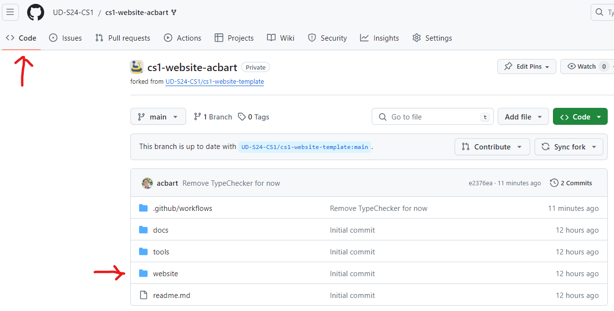
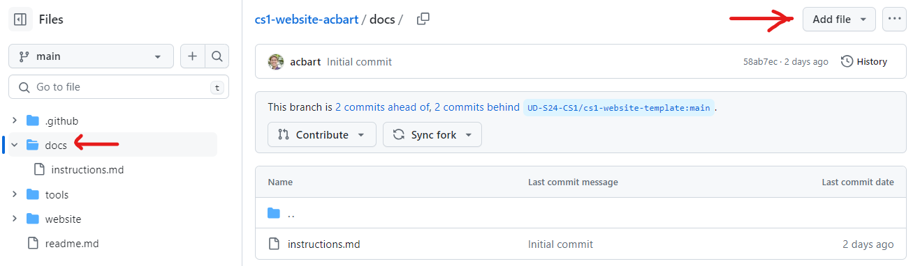

.. _deployment:

Deployment
==========

When you have finished developing your website, you can deploy it to the world on a server.
GitHub Pages is a free and easy way to host your website.
Although normally Github Pages is only useful for hosting frontend websites, Drafter can still work with it.

To deploy your website to GitHub Pages, you need to follow these steps:

Create the Repository
---------------------

1. Use the URL provided by your instructor to create a new repository on Github (**Make sure you use the instructor provided URL for your classroom!**)

Once the repository is created, you will see that there are already a bunch of files present, and a settings bar.

.. image:: images/deployment_github_main.png
    :alt: Github Repository

Enable Github Pages
-------------------

2. You will need to turn on GitHub pages in order to host your site. To do this, go to the ``Settings`` tab of your repository.

.. image:: images/deployment_github_settings.png
    :alt: Github Settings

Scroll down to the ``Pages`` section on the left side of the page. Under the source dropdown, select ``Github Actions``.

.. image:: images/deployment_github_pages.png
    :alt: Github Pages

Your site will now start deploying whenever you make a change. We can check the progress of the deployment by going to the ``Actions`` tab. But first, we'll need to upload our website code.

Upload Your Website Code
------------------------

Warning: if your instructor has requirements about commit messages, review those before doing this step. **Commit messages are very hard to change after the fact.** 

3. Go to the ``Code`` tab and click on the ``website`` folder.



There will be one file by default in the folder, ``main.py``. You can add other files to this folder, and they will be available on your website. However, we must have a ``main.py`` file, which is where the main code for your site should go. Click on the file.

.. image:: images/deployment_github_files.png
    :alt: Github Files

When you click on the file, it will show you the contents of the file. You can edit the file by clicking on the pencil icon.

.. image:: images/deployment_github_edit.png
    :alt: Github Edit Main

The editor area allows you to paste in your code. We recommend that you add the following lines of code to your project.
They need to be after the import statements, but before the ``start_server(...)`` line.
We suggest placing them right before your dataclasses and routes.

.. code-block:: python

    hide_debug_information()
    set_website_title("Your Website Title")
    set_website_framed(False)

These lines of code:

1. Hide all of the debug information - you may want to comment this line out while you do any debugging
2. Set the title of the website in the tab
3. Make the website stretch to fill the whole screen, instead of just the small box.

There are many other ways to style your website, but these are a starting point. 

You can change the filename here, but your instructor may penalize you if you do so.

When you are done, click on the ``Commit changes`` button in the top-right of the page.

.. image:: images/deployment_github_editor.png
    :alt: Github Editor

A box will appear that asks you to write a commit message.
This is a message that describes the changes you made to the file.
You can write anything you want here, but it is recommended to write something that describes the changes you made.
For example, you could write ``Added website``. If you leave the default message, your instructor may penalize you.
**Always write concise, descriptive messages!**

Once you have changed the default message to be more descriptive, you must click on the ``Commit changes`` button to save your changes.

.. image:: images/deployment_github_commit.png
    :alt: Github Commit

If you have other files besides ``main.py``, then check the appendix at the bottom of this document for how to upload them: :ref:`appendix_upload_files`.

.. _video:


Record a Video
--------------

4. Record a video of your web application running, and make sure you show and address all of the following with a voiceover:

* What your web application does
* What each page of your website looks like in action (i.e., walk through the website)
* What the state of your website looks (i.e., explain the fields of your State dataclass)
* Make sure that your video is audible and visible. If we cannot see parts or hear parts, we will treat that those parts as if they do not exist.

Here are some details to keep in mind:

* You do not need to walk through any of the code of your website, but we do want to see all of its features.
* Aim for a video that is 2-5 minutes in length. Do not pad with unnecessary details, but do not skip important parts.
* Think of this video as something you will want to put into a portfolio when you apply for internships and jobs. Try to do a good job.
* Zoom can be used to record videos; again, just make sure that we are able to see and hear everything clearly.

Upload the video to a website where it can be viewed by the graders.
If the video is not publicly accessible, you will not receive credit for this part of the assignment.
Copy the URL of the video to paste into your ``readme.md`` file later.

.. note::

    If you want to record the deployed version of your website, you can skip this step and record the video after you have deployed your website (see step :ref:`view_deployment` ) . Just make sure to record the video before the deadline.

.. _planning_document:

Upload the Planning Document
----------------------------

5. Upload your planning document to the website repository in the ``website`` folder.

First, find the file that you created in the planning phase of the project.
It might be a ``pdf``, ``docx``, ``png``, or some other file type.
Change the filename of the planning document to something simple and easy to type.
In particular, we suggest you avoid spaces and special characters in the filename.
For example, if your planning document is called ``Project Plan.pdf``, you could rename it to just ``plan.pdf``.

Next, you will need to upload the file to the repository, inside of the ``docs`` folder of your website (NOT the ``website`` folder).
Open the ``docs`` folder.



You can either drag your file directly into the folder area or click on the ``Add file`` button and then ``Upload files`` to select the file from your computer.
Once they have been added ("staged"), you can click on the ``Commit changes`` button to save your changes.

.. image:: images/deployment_github_upload.png
    :alt: Github Upload

Once the file is committed, you will see it in the ``docs`` folder. Make a careful note of the filename, exactly as it is typed.
In this case, the file is called ``WebsiteDesign.pdf``

.. image:: images/deployment_github_added.png
    :alt: Github Uploaded

Now we need to link the file in our ``readme.md`` file.

Edit the Readme
---------------

6. Now we need to edit your ``readme.md`` file to update the information about your website. Click on the ``readme.md`` file in the ``website`` folder.

.. image:: images/deployment_github_readme.png
    :alt: Github Readme

Click on the pencil icon to edit the file. You will need to fill in the following fields.

* The name of your site
* What your web application does
* Your name and UD email address
* If you got significant help from a website besides the official Drafter documentation, include links along with explanations of how the site helped you. If someone helped you, this is also a nice place to mention them to thank them for their help. Make sure you provide direct URLs where ever you can.
* The planning document that you created, provided as a file (see :ref:`planning_document` above). At the minimum, you need to link to the file by replacing the text in parentheses with the filename of your planning document (e.g., ``WebsiteDesign.pdf``). If your planning document is an image, you can also embed it directly in the readme by following one of the guides linked below. Note that you should not put `docs/` in front of the file URL, even though the file is in the `docs` folder; when we deploy your site, we'll fix the URL for you.
* The URL (address) of the publicly-accessible video (see :ref:`video` above) that you uploaded, replacing the existing text inside of the angle brackets (``<https://my.video.com/>``) with the URL of your video.

.. image:: images/deployment_github_editme.png
    :alt: Github Readme

This file is written in Markdown, which is a simple way to format text. You can use the following syntax to format your text:

* ``**use two asterisks for bold text**``
* ``*use one asterisk for italics*``
* ``[This text will be hyperlinked to](https://this.url.com/)``
* ``You can also use backticks to `highlight` code inline``
* ``# This is a header``
* ``- This is a bullet point``
* ``1. This is a numbered list``
* ``> This is a blockquote``
* ``--- This is a horizontal rule``
* ````


You can learn more about Markdown `from the Github Guide <https://guides.github.com/features/mastering-markdown/>`_ or the `MarkdownGuide <https://www.markdownguide.org/basic-syntax/>`_ .

You should also add a section with a bulletted list in the ``readme.md`` document describing the project requirements and how you met them.

When you are done, click on the ``Commit changes`` button to save your changes.

.. _view_deployment:

View the Deployment
-------------------

7. When everything is done, you can check out your deployed website. Click on the ``Actions`` link to see the deployments. You can click on the latest deployment to see the logs.

.. image:: images/deployment_github_actions.png
    :alt: Github Actions

If everything is successful, you will see a green checkmark. To actually access your website, you will need to click into the deployment details to get the final URL.
Click on the green checkmark, and you will be presented with the deployed URL. This is what you will submit on Canvas, but check to make sure your game works!

Once you have the deployed URL, you can skip down to the last step to submit on Canvas (see :ref:`submit_on_canvas`).

.. image:: images/deployment_github_success.png
    :alt: Github Success

If you see a red X, there was an error.
You need to click on the red X to get into the job summary, and then click the next red X to get into the deployment logs.

.. image:: images/deployment_github_error.png
    :alt: Github Error

The error below is just an example of what can go wrong.

.. image:: images/deployment_github_details.png
    :alt: Github Error

The screenshot above is just an example of what can go wrong; you might experience something completely different.
In this particular case, the error is simple - the developer forgot to turn on the Github Pages feature in the settings (step 2).

If you see an error, you can try to fix it and push the changes to the repository.
The website will automatically redeploy when you push changes to the repository, and you can check the progress of the new attempt in the Actions tab again.

The Actions section of the repository will list prior deploy attempts in chronological order. So, if you see past attempts with the red X, don't worry about it as long as the top (most recent) deploy attempt was successful. That's the one that matters. 

You can also get more details about the deployment from the deployment dashboard (see :ref:`deployment_dashboard`).
Unless there is a catastrophic error (e.g., you didn't enable GitHub Pages), you should be able to see the dashboard.

View the Readme
---------------

8. If you formatted your ``readme.md`` file correctly, you will be able to view a nicely formatted version of it.

Take your original deployment URL (e.g., ``https://ud-s24-cs1.github.io/cs1-website-username/``) and add ``docs/`` to the end of it (e.g., ``https://ud-s24-cs1.github.io/cs1-website-username/docs/``).

.. image:: images/deployment_github_docs_public.png
    :alt: Github Readme View

Make sure that all of the links work and that the video is visible and audible.
There should be six sections in the readme: website name, description, author, help resources used, planning document, and video.

.. _deployment_dashboard:

Deployment Dashboard
--------------------

Whether your deployment succeeds or fails, there will be a lot of useful information available in the deployment dashboard.

Take your original deployment URL (e.g., ``https://ud-s24-cs1.github.io/cs1-website-username/``) and add ``dashboard/`` to the end of it (e.g., ``https://ud-s24-cs1.github.io/cs1-website-username/dashboard/``).

.. image:: images/deployment_dashboard.png
    :alt: Deployment Dashboard

If there was an error or warning during deployment, that will be shown at the top.
Then there are quick links to things like the deployed site, the github deployment logs, the GitHub repository, commit messages, and your tests.
At the bottom you will see your Build Log, which includes all the steps that Drafter took to deploy your site.

.. _submit_on_canvas:

Submit on Canvas
----------------

9. Once you have successfully deployed your website, you can submit the URL of your website.

Make sure that you submit the **deployed URL** of your website, which will look something like this: ``https://ud-s24-cs1.github.io/cs1-website-username/``.

.. warning::
    Do not the submit the deployed URL with the ``docs/`` extension or the link to the GitHub repository (e.g., ``https://github.com/ud-s24-cs1/cs1-website-username``). Also do not submit the original `https://localhost:8080` link; that URL only works on your computer while the program is running locally, so it will not work on other peoples' machine. Test the link after you submit, from another device. Submitting the wrong link will potentially earn you zero points!


.. _appendix_upload_files:

Appendix: Uploading Files
-------------------------

If you have files other than ``main.py`` that you need to upload to your website, you can follow these steps.

1. Go to the ``Code`` tab and click on the ``website`` folder.
2. Click on the ``Add file`` button and then ``Upload files`` to select the file from your computer.
3. Once they have been added ("staged"), you can click on the ``Commit changes`` button to save your changes. Make sure you write a descriptive commit message!

If you have multiple files, you can upload them all at once by dragging them into the folder area.

Note that you need to upload files to the ``website`` folder, not the ``docs`` folder. The ``docs`` folder is only for the planning document.

If you are using additional Python libraries, you can include a ``requirements.txt`` file in the ``website`` folder to list the libraries you are using.
This file should be uploaded in the same way as other files.
However, not all third-party libraries are supported on the deployed version of Drafter, so you should check with your instructor before using them.

Common Errors
-------------

* **Files not linked correctly in Readme**:
    * Make sure that all of the links in your readme are correct. If you are linking to a file in the ``docs`` folder, you should not include ``docs/`` in the URL. If you are linking to a video, make sure that the video is publicly accessible.
* **Deployment fails**:
    * If your deployment fails, you can check the logs in the Actions tab to see what went wrong. Common errors include not enabling GitHub Pages, not uploading the correct files, or having a syntax error in your code.
