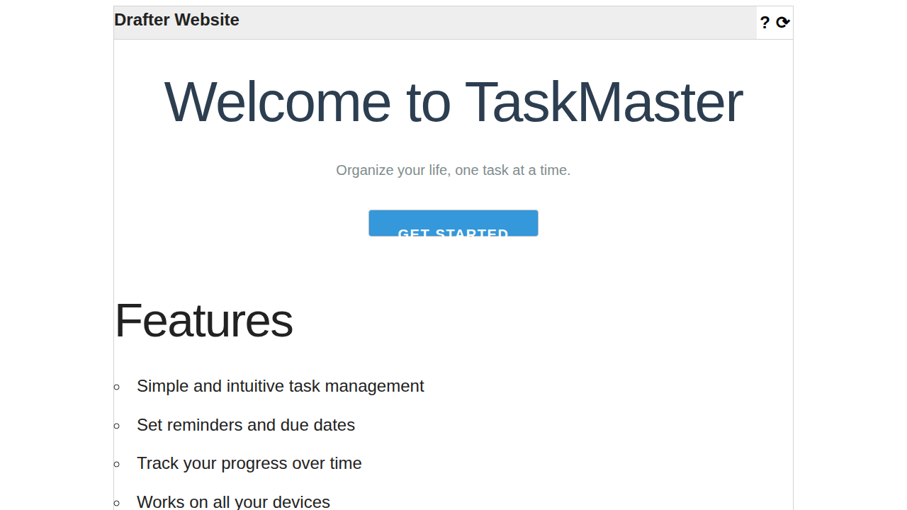
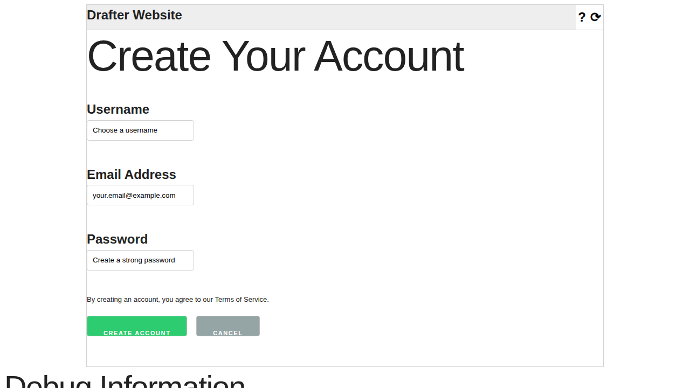

.. _design_principles:

Design Principles for Styling Your Pages
=========================================

When you're creating a website, it's not just about making it work—it's also about making it look good and be easy to use.
Good design helps users understand your website quickly and enjoy using it. This guide will teach you some simple but powerful
principles that professional designers use, adapted specifically for building websites with Drafter.

**Who is this guide for?** This is for beginners who want to make their websites look better but don't know where to start.
You don't need any prior design experience—just a willingness to try new things and see what works!

The Big Picture: What Makes Good Design?
-----------------------------------------

Before we dive into specific techniques, let's talk about what makes a website "well-designed."

**Good design is invisible.** When someone visits your website, they shouldn't have to think about how to use it.
Buttons should look like buttons. Important information should stand out. Navigation should be obvious.
If your users have to stop and think, "Wait, what do I click?" or "Where do I find that?", then the design
isn't doing its job.

**Good design serves a purpose.** Every element on your page should be there for a reason. Ask yourself:
"Does this help my user accomplish their goal?" If not, consider removing it or making it less prominent.

**Good design is consistent.** When things look and behave the same way throughout your website, users feel
comfortable and can focus on what matters—your content and functionality.

Core Design Principles
----------------------

Let's explore the fundamental principles you can apply to make your Drafter pages look professional and be easy to use.

1. Visual Hierarchy: Guide Your User's Eyes
~~~~~~~~~~~~~~~~~~~~~~~~~~~~~~~~~~~~~~~~~~~~

**What is it?** Visual hierarchy means organizing your content so that the most important things stand out first.
Your users' eyes should naturally flow from the most important elements to the least important.

**Why it matters:** When everything looks equally important, nothing stands out. Users get overwhelmed and don't
know where to look first.

**How to create visual hierarchy:**

* **Size matters:** Bigger elements attract more attention. Use larger text for headers and titles.

  .. code-block:: python

      from drafter import *

      @route
      def index(state: str) -> Page:
          return Page(state, [
              Header("Welcome to My Website"),  # Big and bold!
              "This is regular body text that explains what the site is about.",
              "And here's another paragraph with more details."
          ])

* **Color and contrast:** Bright colors and high contrast draw the eye. Use color to highlight important actions.

  .. code-block:: python

      from drafter import *

      @route
      def index(state: str) -> Page:
          return Page(state, [
              "Ready to get started?",
              # This button stands out with color
              Button("Click Here to Begin!", index, style_background_color="green",
                     style_color="white", style_padding="10px 20px")
          ])

* **Weight and emphasis:** Bold text is more noticeable than regular text. Use it for key terms or important warnings.

  .. code-block:: python

      from drafter import *

      @route
      def warning_page(state: str) -> Page:
          return Page(state, [
              bold("Warning:"),
              " Please save your work before continuing."
          ])

**Real example combining hierarchy:**

.. code-block:: python

    from drafter import *

    @route
    def home(state: str) -> Page:
        return Page(state, [
            # Level 1: Most important
            Header("Student Grade Calculator", 1),
            
            # Level 2: Supporting information
            Header("Enter your assignment scores below", 3),
            "Calculate your final grade based on all your assignments.",
            
            # Level 3: Actions
            TextBox("assignment1", "Assignment 1 score"),
            TextBox("assignment2", "Assignment 2 score"),
            Button("Calculate Grade", calculate)
        ])

2. White Space (Breathing Room)
~~~~~~~~~~~~~~~~~~~~~~~~~~~~~~~~

**What is it?** White space (also called "negative space") is the empty area around and between elements on your page.
It doesn't have to be white—it's just space without content.

**Why it matters:** White space makes your content easier to read and less overwhelming. It gives your users' eyes a
place to rest and helps separate different sections of your page.

**How to use white space effectively:**

* **Margins create separation:** Add space around elements to make them feel less cramped.

  .. code-block:: python

      from drafter import *

      @route
      def spacious_page(state: str) -> Page:
          return Page(state, [
              change_margin(Header("Section Title"), "20px 0"),  # 20px top and bottom
              change_margin("This paragraph has breathing room around it.", "10px 0"),
              change_margin(Button("Continue", index), "20px 0")
          ])

* **Padding creates comfort:** Add space inside elements to make them feel more clickable and comfortable.

  .. code-block:: python

      from drafter import *

      @route
      def comfy_buttons(state: str) -> Page:
          return Page(state, [
              # Buttons with padding feel easier to click
              Button("Save", save_page, style_padding="15px 30px"),
              Button("Cancel", index, style_padding="15px 30px")
          ])

* **Line spacing helps readability:** Don't cram text together. Give each line room to breathe.

  .. code-block:: python

      from drafter import *

      @route
      def readable_text(state: str) -> Page:
          return Page(state, [
              change_text_size("This text is easier to read with proper spacing.", "18px"),
              change_margin("The margin between paragraphs helps separate ideas.", "15px 0")
          ])

3. Color: Use It Purposefully
~~~~~~~~~~~~~~~~~~~~~~~~~~~~~~

**What is it?** Color is one of your most powerful design tools. It can set the mood, draw attention, and communicate meaning.

**Why it matters:** The right colors make your website feel professional and guide users to take action. The wrong colors
can make text hard to read or create confusion.

**Basic color principles:**

* **Limit your palette:** Stick to 2-3 main colors plus neutral colors (black, white, gray). Too many colors look chaotic.

  .. code-block:: python

      from drafter import *

      # Define a simple color scheme
      PRIMARY_COLOR = "#3498db"      # A nice blue
      SECONDARY_COLOR = "#2ecc71"    # A green for success
      ACCENT_COLOR = "#e74c3c"       # A red for warnings

      @route
      def color_scheme_example(state: str) -> Page:
          return Page(state, [
              change_color(Header("Welcome!"), PRIMARY_COLOR),
              Button("Start", start_page, style_background_color=SECONDARY_COLOR,
                     style_color="white"),
              change_color(bold("Important Note: "), ACCENT_COLOR)
          ])

* **Ensure good contrast:** Text must be readable against its background. Dark text on light backgrounds (or vice versa) works best.

  .. code-block:: python

      from drafter import *

      @route
      def contrast_example(state: str) -> Page:
          return Page(state, [
              # Good contrast - easy to read
              change_background_color(
                  change_color("Dark text on light background", "#333333"),
                  "#ffffff"
              ),
              # Also good - light text on dark background
              change_background_color(
                  change_color("Light text on dark background", "#ffffff"),
                  "#2c3e50"
              )
          ])

* **Use color to communicate meaning:** People expect certain colors to mean certain things. Use them wisely!

  - **Green** = success, go, positive action
  - **Red** = danger, stop, warning, delete
  - **Blue** = trust, information, calm
  - **Yellow/Orange** = caution, attention needed

  .. code-block:: python

      from drafter import *

      @route
      def meaningful_colors(state: str) -> Page:
          return Page(state, [
              "Your account has been created!",
              Button("Continue", next_page, style_background_color="#2ecc71",
                     style_color="white"),
              LineBreak(),
              change_color(bold("Warning: This action cannot be undone."), "#e74c3c"),
              Button("Delete Account", delete_page, style_background_color="#e74c3c",
                     style_color="white")
          ])

4. Typography: Make Text Easy to Read
~~~~~~~~~~~~~~~~~~~~~~~~~~~~~~~~~~~~~~

**What is it?** Typography is the art of arranging text. It includes choosing fonts, sizes, spacing, and alignment.

**Why it matters:** If users can't easily read your text, they'll leave your website. Good typography makes reading effortless.

**Typography best practices:**

* **Choose readable fonts:** Stick with simple, clean fonts. For Drafter, the default fonts work well for most cases.

  .. code-block:: python

      from drafter import *

      @route
      def font_example(state: str) -> Page:
          return Page(state, [
              # Default font - clean and readable
              "This text uses the default font and is easy to read.",
              # Monospace for code
              monospace("x = 10  # Use monospace for code examples"),
          ])

* **Size appropriately:** Regular body text should be at least 16-18px. Headers should be noticeably larger.

  .. code-block:: python

      from drafter import *

      @route
      def text_sizes(state: str) -> Page:
          return Page(state, [
              Header("Main Title", 1),  # Biggest
              Header("Section Header", 2),  # Big
              Header("Subsection", 3),  # Medium-big
              change_text_size("Body text should be around 16-18px.", "18px"),
              small_font("Use small text sparingly for less important info.")
          ])

* **Align for readability:** Left-aligned text is easiest to read for most western languages. Center alignment is good for titles.

  .. code-block:: python

      from drafter import *

      @route
      def alignment_example(state: str) -> Page:
          return Page(state, [
              change_text_align(Header("Centered Title"), "center"),
              # Body text defaults to left-aligned, which is good!
              "This paragraph is left-aligned, making it easy to read.",
              "Each line starts at the same place, so your eyes can flow naturally.",
          ])

* **Emphasize wisely:** Use bold for important information, italic for subtle emphasis. Don't use both at once.

  .. code-block:: python

      from drafter import *

      @route
      def emphasis_example(state: str) -> Page:
          return Page(state, [
              bold("Important:"),
              " This is a key concept you should remember.",
              LineBreak(),
              "The word ",
              italic("specifically"),
              " is emphasized here for subtle effect."
          ])

5. Consistency: Keep Things Predictable
~~~~~~~~~~~~~~~~~~~~~~~~~~~~~~~~~~~~~~~~

**What is it?** Consistency means using the same styles and patterns throughout your website. Similar things should look similar.

**Why it matters:** When users learn how one part of your website works, consistency means they automatically understand the rest.

**How to be consistent:**

* **Define your styles once:** Use variables or constants for colors, sizes, and common styles.

  .. code-block:: python

      from drafter import *

      # Define your style constants at the top
      BUTTON_PADDING = "12px 24px"
      BUTTON_BACKGROUND = "#3498db"
      BUTTON_TEXT_COLOR = "white"
      SECTION_MARGIN = "20px 0"

      @route
      def consistent_page(state: str) -> Page:
          return Page(state, [
              change_margin(Header("First Section"), SECTION_MARGIN),
              Button("First Action", page1,
                     style_padding=BUTTON_PADDING,
                     style_background_color=BUTTON_BACKGROUND,
                     style_color=BUTTON_TEXT_COLOR),
              
              change_margin(Header("Second Section"), SECTION_MARGIN),
              Button("Second Action", page2,
                     style_padding=BUTTON_PADDING,
                     style_background_color=BUTTON_BACKGROUND,
                     style_color=BUTTON_TEXT_COLOR)
          ])

* **Use the same spacing everywhere:** If you use 20px margins in one place, use 20px margins everywhere.

* **Keep button styles uniform:** All primary buttons should look the same. All secondary buttons should look the same.

6. Alignment: Create Order and Structure
~~~~~~~~~~~~~~~~~~~~~~~~~~~~~~~~~~~~~~~~~

**What is it?** Alignment is about lining things up. When elements align with each other, the page feels more organized.

**Why it matters:** Proper alignment creates invisible lines that guide the user's eye and make your page feel professional.

**Alignment techniques:**

* **Align related items:** Things that go together should line up together.

  .. code-block:: python

      from drafter import *

      @route
      def aligned_form(state: str) -> Page:
          return Page(state, [
              Header("Sign Up Form"),
              # Form elements naturally align when stacked
              TextBox("username", "Enter username"),
              TextBox("email", "Enter email"),
              TextBox("password", "Enter password"),
              Button("Create Account", signup)
          ])

* **Use floating for side-by-side layouts:** Float elements to create columns or align items horizontally.

  .. code-block:: python

      from drafter import *

      @route
      def side_by_side(state: str) -> Page:
          return Page(state, [
              Header("Choose Your Option"),
              Div(
                  change_width(
                      Div(
                          Header("Option A", 3),
                          "Description of option A",
                          Button("Choose A", option_a)
                      ),
                      "45%"
                  ),
                  change_width(
                      float_right(Div(
                          Header("Option B", 3),
                          "Description of option B",
                          Button("Choose B", option_b)
                      )),
                      "45%"
                  )
              )
          ])

Practical Patterns: Putting It All Together
--------------------------------------------

Now let's look at some complete examples that demonstrate these principles working together.

Example 1: A Clean Landing Page
~~~~~~~~~~~~~~~~~~~~~~~~~~~~~~~~

This example shows a simple, clean landing page with good visual hierarchy, white space, and consistent styling.

.. code-block:: python

    from drafter import *

    # Style constants for consistency
    PRIMARY_COLOR = "#2c3e50"
    ACCENT_COLOR = "#3498db"

    @route
    def index(state: str) -> Page:
        return Page(state, [
            # Main title - largest and centered for impact
            Div(
                Header("Welcome to TaskMaster"),
                style=f"text-align: center; color: {PRIMARY_COLOR}; font-size: 48px; margin-top: 40px;"
            ),
            
            # Subtitle - smaller, centered, with margin
            Div(
                "Organize your life, one task at a time.",
                style="text-align: center; color: #7f8c8d; margin: 10px 0 40px 0; font-size: 20px;"
            ),
            
            # Call to action - centered with good padding
            Div(
                Button("Get Started", signup, style_padding="15px 40px",
                       style_background_color=ACCENT_COLOR, style_color="white",
                       style_font_size="20px"),
                style="text-align: center; margin: 20px 0;"
            ),
            
            # Features section with space
            Div(
                Header("Features", 2),
                style="margin: 60px 0 20px 0;"
            ),
            
            BulletedList([
                "Simple and intuitive task management",
                "Set reminders and due dates",
                "Track your progress over time",
                "Works on all your devices"
            ])
        ])

Example 2: A User-Friendly Form
~~~~~~~~~~~~~~~~~~~~~~~~~~~~~~~~

This example demonstrates a well-designed form with clear labels, good spacing, and helpful visual cues.

.. code-block:: python

    from drafter import *

    @route
    def index(state: str) -> Page:
        return Page(state, [
            # Clear title
            Div(
                Header("Create Your Account"),
                style="margin: 0 0 30px 0;"
            ),
            
            # Form with good spacing
            Div(
                bold("Username"),
                LineBreak(),
                TextBox("username", "Choose a username"),
                style="margin: 0 0 20px 0;"
            ),
            
            Div(
                bold("Email Address"),
                LineBreak(),
                TextBox("email", "your.email@example.com"),
                style="margin: 0 0 20px 0;"
            ),
            
            Div(
                bold("Password"),
                LineBreak(),
                TextBox("password", "Create a strong password"),
                style="margin: 0 0 20px 0;"
            ),
            
            # Terms with smaller text
            Div(
                small_font("By creating an account, you agree to our Terms of Service."),
                style="margin: 10px 0 20px 0;"
            ),
            
            # Action buttons - primary action is more prominent
            Button("Create Account", process_signup,
                   style_background_color="#2ecc71", style_color="white",
                   style_padding="12px 30px", style_margin_right="10px"),
            Button("Cancel", index,
                   style_background_color="#95a5a6", style_color="white",
                   style_padding="12px 30px")
        ])

Example 3: An Information Dashboard
~~~~~~~~~~~~~~~~~~~~~~~~~~~~~~~~~~~~

This example shows how to present multiple pieces of information clearly with good organization.

.. code-block:: python

    from drafter import *

    @route
    def dashboard(state: dict) -> Page:
        # Using boxes with background colors to group information
        stats_style = "background-color: #ecf0f1; padding: 20px; margin: 10px 0; border-radius: 5px;"
        
        return Page(state, [
            Header("Your Dashboard"),
            
            # Statistics section with visual grouping
            Header("Quick Stats", 2),
            
            Div(
                change_text_align(
                    Div(
                        large_font(bold(str(state['tasks_completed']))),
                        LineBreak(),
                        "Tasks Completed"
                    ),
                    "center"
                ),
                style=stats_style
            ),
            
            Div(
                change_text_align(
                    Div(
                        large_font(bold(str(state['tasks_remaining']))),
                        LineBreak(),
                        "Tasks Remaining"
                    ),
                    "center"
                ),
                style=stats_style
            ),
            
            # Recent activity
            change_margin(Header("Recent Activity", 2), "40px 0 20px 0"),
            BulletedList(state['recent_activities'][:5]),
            
            # Action button
            change_margin(
                Button("Add New Task", add_task,
                       style_background_color="#3498db", style_color="white",
                       style_padding="10px 20px"),
                "30px 0"
            )
        ])

Common Mistakes to Avoid
-------------------------

As you're learning, here are some common design mistakes that beginners make:

1. **Using too many colors:** Stick to a simple palette. Three colors plus neutrals is plenty.

2. **Making text too small:** If users have to squint, make it bigger! 16-18px minimum for body text.

3. **Not enough contrast:** If text is hard to read, it's probably a contrast problem. Make sure there's enough
   difference between text color and background color.

4. **Crowding elements:** Give things room to breathe! Use margins and padding generously.

5. **Inconsistent styling:** Don't make every button look different. Consistency builds trust.

6. **Overusing bold and italic:** When everything is emphasized, nothing stands out. Use emphasis sparingly.

7. **Center-aligning everything:** Center alignment is great for titles, but body text should be left-aligned.

Tools and Resources
-------------------

Here are some helpful resources as you continue your design journey:

**Color Tools:**

* `Coolors <https://coolors.co/>`_ - Generate color palettes
* `Color Hunt <https://colorhunt.co/>`_ - Browse popular color schemes
* `WebAIM Contrast Checker <https://webaim.org/resources/contrastchecker/>`_ - Check if your colors have enough contrast

**Inspiration:**

* Look at websites you use every day. What makes them easy to use?
* Pay attention to spacing, colors, and how information is organized
* Try recreating simple layouts you like in Drafter as practice

**Books and Articles:**

* "Don't Make Me Think" by Steve Krug - Classic book on web usability
* "The Design of Everyday Things" by Don Norman - Fundamental design principles
* `Laws of UX <https://lawsofux.com/>`_ - Quick reference for UX principles

Getting Started: Your First Steps
----------------------------------

Ready to improve your designs? Here's what to do:

1. **Start simple:** Pick one principle from this guide (like using white space or improving color contrast) and
   apply it to your current project.

2. **Get feedback:** Show your website to friends or classmates. Do they understand how to use it without you
   explaining anything?

3. **Iterate:** Design is about trying things and seeing what works. Don't be afraid to experiment!

4. **Build a style guide:** As your project grows, write down your color codes, spacing values, and other
   style decisions. This helps you stay consistent.

5. **Practice:** The more pages you design, the better you'll get. Each project is a chance to improve.

Remember, good design is about making your users' lives easier. Every style choice should serve that goal.
Start with these principles, practice regularly, and soon you'll be creating websites that not only work well
but look great too!

Next Steps
----------

Now that you understand the design principles, you're ready to learn the technical details of how to apply
these styles in Drafter. Check out these resources:

* :ref:`styling` - Learn all the technical styling methods and complete reference of styling functions in Drafter
* `Examples <https://drafter-edu.github.io/drafter/examples/examples.html>`_ - See complete example projects

Happy designing!
