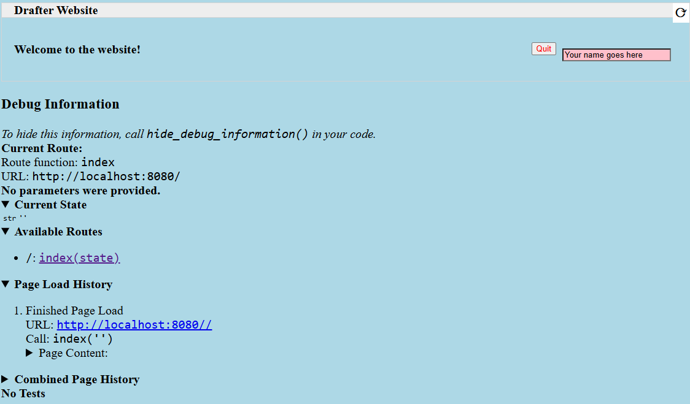

.. _styling:

Styling
=======

If you want to make your page pretty, then there's a number of ways to control the **style** of your components.
In HTML, you can style components using `CSS (Cascading Style Sheets) <https://developer.mozilla.org/en-US/docs/Web/CSS>`_. CSS allows you to control the appearance of
your components, such as the font, color, size, and position. Drafter provides several ways to style components.
You can use the built-in styling functions, keyword parameters, CSS classes, CSS style tags, and website-wide CSS.

Drafter generates plain HTML and CSS, so you can use any CSS styling you want. However, Drafter also provides
some built-in functions to make styling easier.

The following section gives examples of how to style your components using these methods,
with links to the more detailed sub-sections.

A Full Styling Example
----------------------

Here is an example of how you might use the styling functions and keyword parameters to style a page:

.. code-block:: python

    from drafter import *

    set_website_style("none")
    add_website_css("""
    body {
        background-color: lightblue;
        font-size: 20px;
    }

    .name-box {
        background-color: pink;
        float: right;
    }
    """)

    PAGE_SPECIFIC_STYLE = """
    """,

    @route
    def index(state: str) -> Page:
        return Page(state, [
            PAGE_SPECIFIC_STYLE,
            bold("Welcome to the website!"),
            TextBox("Name", "Your name goes here", classes="name-box"),
            Button("Quit", index, style_color="red", style_float='right')
        ])

    start_server("")

This demonstrates the following concepts:

* Disabling the default theme (``set_website_style("none")``: `changing themes`_
* Adding custom CSS to the website (``add_website_css``): `Adding Website CSS`_
* Using CSS classes to style components (``classes`` keyword parameter): `CSS Classes`_
* Using styling functions to style components (e.g., ``bold``): `Styling Functions`_
* Using keyword parameters to style components (e.g., ``style_color`` and ``style_float``): `Keyword Parameters`_
* Embedding a CSS style tag in a page (``PAGE_SPECIFIC_STYLE``): `CSS Style Tags`_

Here's what that basic example might look like when rendered in a browser:

Styling Functions
-----------------

One of the easiest ways to apply styling to components is to use the
styling functions available. These functions take a component and return
the same component, but with additional styling applied.

.. code-block:: python

    def index(state: State) -> Page:
        return Page(state, [
            float_right(Button("Quit", index))
        ])

The above example shows how to use the ``float_right`` function to make
the button align on the right hand side of the screen.

The following functions are available:

.. function:: float_left(component)

    Makes the component "float" to the left, allowing other components to wrap around it.

.. function:: float_right(component)

    Makes the component "float" to the right, so that it aligns to the right side of the screen.

.. function:: bold(component)

    Makes the text bold (increasing the font weight and making it darker). Usually used to indicate importance.

.. function:: italic(component)

    Makes the text italic (slanted to the right). Usually used to indicate emphasis.

.. function:: underline(component)

    Adds an underline to the text. Usually used to indicate that the text is a link, so use sparingly.

.. function:: strikethrough(component)

    Adds a line through the text. Usually used to indicate that the text is no longer relevant.

.. function:: monospace(component)

    Changes the font to a monospace font (all the characters will be the same width). Usually used to indicate that the text is code.

.. function:: small_font(component)

    Makes the font size smaller. Usually used for less important text.

.. function:: large_font(component)

    Makes the font size larger. Usually used for more important text. Consider using a header instead.

.. function:: change_color(component, color)

    Changes the text color. The color can be a named color (e.g. "red") or a hex code (e.g. "#FF0000").
    See the :ref:`colors` page for available HTML colors.

    :param color: The color to change the text to.
    :type color: str

.. function:: change_background_color(component, color)

    Changes the background color of the component (the ``background-color`` CSS attribute). The color can be a named color (e.g. "red") or a hex code (e.g. "#FF0000").
    See the :ref:`colors` page for available HTML colors.

    :param color: The color to change the background to.
    :type color: str

.. function:: change_text_size(component, size)

    Changes the text size. The size must be a string followed by the units (e.g. "16px") or an integer (e.g. 16).
    If an integer is given, the units are assumed to be pixels. Valid units are:

    * px: Pixels
    * em: Relative to the font size of the element
    * rem: Relative to the font size of the root element
    * %: Percentage of the parent element's font size

    :param size: The size to change the text to.
    :type size: int or str

.. function:: change_text_font(component, font)

    Changes the font of the text. The font must be a valid font name (e.g. ``"Arial"``, ``"Times New Roman"``, ``"Courier New"``).
    See the :ref:`fonts` page for available fonts.

    :param font: The font to change the text to.
    :type font: str

.. function:: change_text_align(component, alignment)

    Changes the text alignment. The alignment must be one of the following:

    * ``left``: Aligns the text to the left
    * ``right``: Aligns the text to the right
    * ``center``: Centers the text
    * ``justify``: Justifies the text (evenly spaces the words)

    :param alignment: The alignment to change the text to.
    :type alignment: str

.. function:: change_text_decoration(component, decoration)

    Changes the text decoration. The decoration must be one of the following:

    * ``none``: No decoration
    * ``underline``: Adds an underline
    * ``overline``: Adds a line over the text
    * ``line-through``: Adds a line through the text

    :param decoration: The decoration to change the text to.
    :type decoration: str

.. function:: change_text_transform(component, transform)

    Changes the text transformation. The transformation must be one of the following:

    * ``none``: No transformation
    * ``uppercase``: Converts the text to uppercase
    * ``lowercase``: Converts the text to lowercase
    * ``capitalize``: Capitalizes the first letter of each word

    :param transform: The transformation to change the text to.
    :type transform: str

.. function:: change_margin(component, margin)

    Changes the margin of the component. The margin is the space around the component (as opposed to its padding,
    which is the space inside the component). The margin must be a string of 1-4 numbers followed by the units (e.g. "16px") or an integer (e.g. 16),
    separated by spaces.

    The margin must be a string followed by the units (e.g. "16px") or an integer (e.g. 16).
    If an integer is given, the units are assumed to be pixels. Valid units are:

    * px: Pixels
    * em: Relative to the font size of the element
    * rem: Relative to the font size of the root element
    * %: Percentage of the parent element's font size

    .. code-block:: python

        change_margin(Div("Hello"), "16px")  # Adds a 16px margin to all sides
        change_margin(Div("Hello"), "16px 8px")  # Adds a 16px margin to the top and bottom, and an 8px margin to the left and right
        change_margin(Div("Hello"), "16px 8px 4px 2px")  # Adds a 16px margin to the top, 8px to the right, 4px to the bottom, and 2px to the left

    :param margin: The margin to change the component to.
    :type margin: int or str

.. function:: change_border(component, border)

    Changes the border of the component. The border is a string that can be one of the following:

    * ``none``: No border
    * ``solid``: A solid line border
    * ``dotted``: A dotted line border
    * ``dashed``: A dashed line border
    * ``double``: A double line border
    * ``groove``: A 3D grooved border

    Additionally, a border can have a width and color. The width must be a string followed by the units (e.g. "1px") or an integer (e.g. 1).
    The color can be a named color (e.g. "red") or a hex code (e.g. "#FF0000"); see the :ref:`colors` page for available HTML colors.
    The format is ``"style width color"``. For example:

    .. code-block:: python

        change_border(Div("Hello"), "solid 1px red")  # Adds a solid 1px red border
        change_border(Div("Hello"), "dotted 2px blue")  # Adds a dotted 2px blue border
        change_border(Div("Hello"), "double 3px green")  # Adds a double 3px green border

    :param border: The border to change the component to.
    :type border: str

.. function:: change_padding(component, padding)

    Changes the padding of the component. The padding is the space inside the component (as opposed to its margin,
    which is the space around the component). The padding must be a string of 1-4 numbers followed by the units (e.g. "16px") or an integer (e.g. 16),

    The padding must be a string followed by the units (e.g. "16px") or an integer (e.g. 16).
    If an integer is given, the units are assumed to be pixels. Valid units are:

    * px: Pixels
    * em: Relative to the font size of the element
    * rem: Relative to the font size of the root element
    * %: Percentage of the parent element's font size

    .. code-block:: python

        change_padding(Div("Hello"), "16px")  # Adds a 16px padding to all sides
        change_padding(Div("Hello"), "16px 8px")  # Adds a 16px padding to the top and bottom, and an 8px padding to the left and right
        change_padding(Div("Hello"), "16px 8px 4px 2px")  # Adds a 16px padding to the top, 8px to the right, 4px to the bottom, and 2px to the left

    :param padding: The padding to change the component to.
    :type padding: int or str

.. function:: change_width(component, width)

    Changes the width of the component. The width must be a string followed by the units (e.g. "16px") or an integer (e.g. 16).
    If an integer is given, the units are assumed to be pixels. Valid units are:

    * px: Pixels
    * em: Relative to the font size of the element
    * rem: Relative to the font size of the root element
    * %: Percentage of the parent element's font size

    :param width: The width to change the component to.
    :type width: int or str

.. function:: change_height(component, height)

    Changes the height of the component. The height must be a string followed by the units (e.g. "16px") or an integer (e.g. 16).
    If an integer is given, the units are assumed to be pixels. Valid units are:

    * px: Pixels
    * em: Relative to the font size of the element
    * rem: Relative to the font size of the root element
    * %: Percentage of the parent element's font size

    :param height: The height to change the component to.
    :type height: int or str

Keyword Parameters
------------------

Another way to style components is to use keyword parameters. Any component can take
`style_` prefixed keyword parameters. For example:

.. code-block:: python

    @route
    def index(state: State) -> Page:
        return Page(state, [
            Button("Quit", index, style_text_color="red", style_float='right')
        ])

The example above makes the text red and floats the button to the right.

Drafter will automatically convert the keyword parameters to CSS styles, by applying the following rules:

1. If the keyword parameter does not begin with ``style_``, then the result will be an `HTML attribute <https://developer.mozilla.org/en-US/docs/Web/HTML/Attributes>`_.
2. If it does begin with ``style_``, then the result will be an `inline CSS style attribute <https://developer.mozilla.org/en-US/docs/Web/HTML/Global_attributes/style>`_ of the tag, with the ``style_`` prefix removed.
3. Any underscores in the keyword parameter will be converted to hyphens in the CSS style attribute.
4. The value of the keyword parameter will be used as the value of the CSS style attribute, converted to a string using the ``str`` function.

So for example, the following Drafter code:

.. code-block:: python

    Span("Hello World", style_font_size=50)

Will generate the following HTML:

.. code-block:: html

    Hello World

CSS Style Tags
--------------

Since you can embed HTML into any ``Page`` component, you can also embed CSS style tags.

.. code-block:: python

    @route
    def index(state: State) -> Page:
        return Page(state, [
            """
            
            """
        ])

This is a more dramatic change, since it will update all buttons across the entire page.

CSS Classes
-----------

You can narrow down the styling by using CSS classes. You can add a class to any component
using the ``classes`` keyword parameter. You can then use the class name in your CSS style.

.. code-block:: python

    # Global Constant for cleaner, reusable code
    STYLE = """
    
    """

    @route
    def index(state: State) -> Page:
        return Page(state, [
            STYLE,
            Button("Quit", index, classes="quit-button")
        ])

Don't forget to include the ``STYLE`` constant in every page that uses the ``quit-button`` class.

If you are using the default theme (``skeleton``), then you may need to be more specific with your CSS selectors.
For example, if you want to style a button, you may need to use the following CSS:

.. code-block:: css

    button.quit-button {
        color: red;
        float: right;
    }

Otherwise, the default theme may override your styles. You can disable the default theme by
using ``set_website_style("none")`` (see `changing themes`_).

Adding Website CSS
------------------

If you don't want to have to include the ``STYLE`` constant in every page, you can use the
``add_website_css`` function to add the CSS to every page on the website:

.. function:: add_website_css(css: str)
              add_website_css(selector: str, css: str)

    Adds additional CSS content to the website. This is useful for adding custom
    CSS to the website, either for specific selectors or for general styles.
    If you only provide one parameter, it will be wrapped in <style> tags.
    If you provide both parameters, they will be used to create a CSS rule; the first parameter
    is the CSS selector, and the second parameter is the CSS content that will be wrapped in {}.

    .. code-block:: python

        add_website_css("body", "background-color: lightblue;")
        add_website_css("button.quit-button", "color: red; float: right;")
        add_website_css("""
        body {
            background-color: lightblue;
            font-size: 20px;
        }
        """)

    :param selector: The CSS selector to apply the CSS to, or the CSS content if the second parameter is None.
    :type selector: str
    :param css: The CSS content to apply to the selector.
    :type css: str

This can be placed anywhere before the ``start_server`` function is called, but we recommend putting it
directly after your imports for clarity.

.. _changing themes:

Changing Themes
---------------

Drafter ships with a default theme called ``skeleton``. You can change the theme by using the
``set_website_style`` function. There are currently a few different options.

.. function:: set_website_style(style: str)

    Sets the website style to the specified theme. The theme must be one of the following:

    * ``skeleton``: The default theme, which is a simple, clean theme that does not require additional CSS classes. Check <http://getskeleton.com/> for more information.
    * ``mvp``: Check out <http://andybrewer.github.io/mvp/> for more information.
    * ``sakura``: Check out <https://oxal.org/projects/sakura/> for more information.
    * ``simple``: Check out <https://simplecss.org/> for more information.
    * ``tacit``: Check out <https://yegor256.github.io/tacit/> for more information.
    * ``98``: A theme based on Windows 98. Check out <https://www.98.css> for more information.
    * ``XP``: A theme based on Windows XP. Check out <http://botoxparty.github.io/XP.css/> for more information.
    * ``7``: A theme based on Windows 7. Check out <http://khang-nd.github.io/7.css/> for more information.
    * ``bootstrap``: A more complex theme that requires additional CSS classes to style components.
    * ``none``: Disables the default theme, allowing you to style everything yourself.

    .. code-block:: python

        set_website_style("mvp")
        set_website_style("skeleton")
        set_website_style("none")

    :param style: The theme to set the website style to.
    :type style: str

This can be placed anywhere before the ``start_server`` function is called, but we recommend putting it
directly after your imports for clarity.
